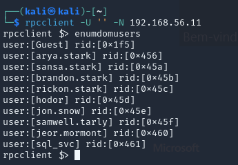
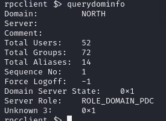
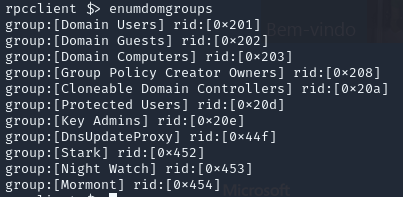

with “guest” we can't enumerate users but 

a null users can enumerate them :

Guest 
arya.stark 
sansa.stark 
brandon.stark 
rickon.stark 
hodor 
jon.snow 
samwell.tarly 
jeor.mormont 
sql_svc 

dominfo :

domgroups :

group queries :

rpcclient $> querygroup 0x452
        Group Name:     Stark
        Description:
        Group Attribute:7
        Num Members:9
rpcclient $> querygroup 0x453
        Group Name:     Night Watch
        Description:
        Group Attribute:7
        Num Members:3
rpcclient $> querygroup 0x454
        Group Name:     Mormont
        Description:
        Group Attribute:7
        Num Members:1
rpcclient $> querygroup 0x201
        Group Name:     Domain Users
        Description:    All domain users
        Group Attribute:7
        Num Members:16
rpcclient $> querygroup 0x202
        Group Name:     Domain Guests
        Description:    All domain guests
        Group Attribute:7
        Num Members:1
rpcclient $> querygroup 0x203
        Group Name:     Domain Computers
        Description:    All workstations and servers joined to the domain
        Group Attribute:7
        Num Members:1
rpcclient $> querygroup 0x208
        Group Name:     Group Policy Creator Owners
        Description:    Members in this group can modify group policy for the domain
        Group Attribute:7
        Num Members:1
rpcclient $> querygroup 0x208a
result was NT_STATUS_NO_SUCH_GROUP
rpcclient $> querygroup 0x20a
        Group Name:     Cloneable Domain Controllers
        Description:    Members of this group that are domain controllers may be cloned.
        Group Attribute:7
        Num Members:0
rpcclient $> querygroup 0x20d
        Group Name:     Protected Users
        Description:    Members of this group are afforded additional protections against authentication security threats. See <http://go.microsoft.com/fwlink/?LinkId=298939> for more information.
        Group Attribute:7
        Num Members:0
rpcclient $> querygroup 0x20e
        Group Name:     Key Admins
        Description:    Members of this group can perform administrative actions on key objects within the domain.
        Group Attribute:7
        Num Members:0

queryusers :

rpcclient $> queryuser guest
        User Name   :   Guest
        Full Name   :
        Home Drive  :
        Dir Drive   :
        Profile Path:
        Logon Script:
        Description :   Built-in account for guest access to the computer/domain
        Workstations:
        Comment     :
        Remote Dial :
        Logon Time               :      Wed, 31 Dec 1969 19:00:00 EST
        Logoff Time              :      Wed, 31 Dec 1969 19:00:00 EST
        Kickoff Time             :      Wed, 13 Sep 30828 22:48:05 EDT
        Password last set Time   :      Wed, 31 Dec 1969 19:00:00 EST
        Password can change Time :      Wed, 31 Dec 1969 19:00:00 EST
        Password must change Time:      Wed, 13 Sep 30828 22:48:05 EDT
        unknown_2[0..31]...
        user_rid :      0x1f5
        group_rid:      0x202
        acb_info :      0x00000215
        fields_present: 0x00ffffff
        logon_divs:     168
        bad_password_count:     0x00000000
        logon_count:    0x00000000
        padding1[0..7]...
        logon_hrs[0..21]...

rpcclient $> queryuser arya.stark
        User Name   :   arya.stark
        Full Name   :
        Home Drive  :
        Dir Drive   :
        Profile Path:
        Logon Script:
        Description :   Arya Stark
        Workstations:
        Comment     :
        Remote Dial :
        Logon Time               :      Wed, 31 Dec 1969 19:00:00 EST
        Logoff Time              :      Wed, 31 Dec 1969 19:00:00 EST
        Kickoff Time             :      Wed, 13 Sep 30828 22:48:05 EDT
        Password last set Time   :      Thu, 19 Dec 2024 00:13:51 EST
        Password can change Time :      Fri, 20 Dec 2024 00:13:51 EST
        Password must change Time:      Wed, 13 Sep 30828 22:48:05 EDT
        unknown_2[0..31]...
        user_rid :      0x456
        group_rid:      0x201
        acb_info :      0x00000210
        fields_present: 0x00ffffff
        logon_divs:     168
        bad_password_count:     0x00000000
        logon_count:    0x00000000
        padding1[0..7]...
        logon_hrs[0..21]...
rpcclient $> queryuser sansa.stark
        User Name   :   sansa.stark
        Full Name   :
        Home Drive  :
        Dir Drive   :
        Profile Path:
        Logon Script:
        Description :   Sansa Stark
        Workstations:
        Comment     :
        Remote Dial :
        Logon Time               :      Wed, 31 Dec 1969 19:00:00 EST
        Logoff Time              :      Wed, 31 Dec 1969 19:00:00 EST
        Kickoff Time             :      Wed, 13 Sep 30828 22:48:05 EDT
        Password last set Time   :      Thu, 19 Dec 2024 00:14:12 EST
        Password can change Time :      Fri, 20 Dec 2024 00:14:12 EST
        Password must change Time:      Wed, 13 Sep 30828 22:48:05 EDT
        unknown_2[0..31]...
        user_rid :      0x45a
        group_rid:      0x201
        acb_info :      0x00000210
        fields_present: 0x00ffffff
        logon_divs:     168
        bad_password_count:     0x00000000
        logon_count:    0x00000000
        padding1[0..7]...
        logon_hrs[0..21]...
rpcclient $> queryuser brandon.stark
        User Name   :   brandon.stark
        Full Name   :
        Home Drive  :
        Dir Drive   :
        Profile Path:
        Logon Script:
        Description :   Brandon Stark
        Workstations:
        Comment     :
        Remote Dial :
        Logon Time               :      Wed, 31 Dec 1969 19:00:00 EST
        Logoff Time              :      Wed, 31 Dec 1969 19:00:00 EST
        Kickoff Time             :      Wed, 13 Sep 30828 22:48:05 EDT
        Password last set Time   :      Thu, 19 Dec 2024 00:14:16 EST
        Password can change Time :      Fri, 20 Dec 2024 00:14:16 EST
        Password must change Time:      Wed, 13 Sep 30828 22:48:05 EDT
        unknown_2[0..31]...
        user_rid :      0x45b
        group_rid:      0x201
        acb_info :      0x00010210
        fields_present: 0x00ffffff
        logon_divs:     168
        bad_password_count:     0x00000000
        logon_count:    0x00000000
        padding1[0..7]...
        logon_hrs[0..21]...
rpcclient $> queryuser rickon.stark
        User Name   :   rickon.stark
        Full Name   :
        Home Drive  :
        Dir Drive   :
        Profile Path:
        Logon Script:
        Description :   Rickon Stark
        Workstations:
        Comment     :
        Remote Dial :
        Logon Time               :      Wed, 31 Dec 1969 19:00:00 EST
        Logoff Time              :      Wed, 31 Dec 1969 19:00:00 EST
        Kickoff Time             :      Wed, 13 Sep 30828 22:48:05 EDT
        Password last set Time   :      Thu, 19 Dec 2024 00:14:20 EST
        Password can change Time :      Fri, 20 Dec 2024 00:14:20 EST
        Password must change Time:      Wed, 13 Sep 30828 22:48:05 EDT
        unknown_2[0..31]...
        user_rid :      0x45c
        group_rid:      0x201
        acb_info :      0x00000210
        fields_present: 0x00ffffff
        logon_divs:     168
        bad_password_count:     0x00000000
        logon_count:    0x00000000
        padding1[0..7]...
        logon_hrs[0..21]...
rpcclient $> queryuser jon.snow
        User Name   :   jon.snow
        Full Name   :
        Home Drive  :
        Dir Drive   :
        Profile Path:
        Logon Script:
        Description :   Jon Snow
        Workstations:
        Comment     :
        Remote Dial :
        Logon Time               :      Wed, 31 Dec 1969 19:00:00 EST
        Logoff Time              :      Wed, 31 Dec 1969 19:00:00 EST
        Kickoff Time             :      Wed, 13 Sep 30828 22:48:05 EDT
        Password last set Time   :      Thu, 19 Dec 2024 00:14:30 EST
        Password can change Time :      Fri, 20 Dec 2024 00:14:30 EST
        Password must change Time:      Wed, 13 Sep 30828 22:48:05 EDT
        unknown_2[0..31]...
        user_rid :      0x45e
        group_rid:      0x201
        acb_info :      0x00040210
        fields_present: 0x00ffffff
        logon_divs:     168
        bad_password_count:     0x00000000
        logon_count:    0x00000000
        padding1[0..7]...
        logon_hrs[0..21]...

rpcclient $> queryuser hodor
        User Name   :   hodor
        Full Name   :
        Home Drive  :
        Dir Drive   :
        Profile Path:
        Logon Script:
        Description :   Brainless Giant
        Workstations:
        Comment     :
        Remote Dial :
        Logon Time               :      Wed, 31 Dec 1969 19:00:00 EST
        Logoff Time              :      Wed, 31 Dec 1969 19:00:00 EST
        Kickoff Time             :      Wed, 13 Sep 30828 22:48:05 EDT
        Password last set Time   :      Thu, 19 Dec 2024 00:14:25 EST
        Password can change Time :      Fri, 20 Dec 2024 00:14:25 EST
        Password must change Time:      Wed, 13 Sep 30828 22:48:05 EDT
        unknown_2[0..31]...
        user_rid :      0x45d
        group_rid:      0x201
        acb_info :      0x00000210
        fields_present: 0x00ffffff
        logon_divs:     168
        bad_password_count:     0x00000000
        logon_count:    0x00000000
        padding1[0..7]...
        logon_hrs[0..21]...
rpcclient $> queryuser samwell.tarly
        User Name   :   samwell.tarly
        Full Name   :
        Home Drive  :
        Dir Drive   :
        Profile Path:
        Logon Script:
        Description :   Samwell Tarly (Password : Heartsbane)
        Workstations:
        Comment     :
        Remote Dial :
        Logon Time               :      Wed, 31 Dec 1969 19:00:00 EST
        Logoff Time              :      Wed, 31 Dec 1969 19:00:00 EST
        Kickoff Time             :      Wed, 13 Sep 30828 22:48:05 EDT
        Password last set Time   :      Thu, 19 Dec 2024 00:14:35 EST
        Password can change Time :      Fri, 20 Dec 2024 00:14:35 EST
        Password must change Time:      Wed, 13 Sep 30828 22:48:05 EDT
        unknown_2[0..31]...
        user_rid :      0x45f
        group_rid:      0x201
        acb_info :      0x00000210
        fields_present: 0x00ffffff
        logon_divs:     168
        bad_password_count:     0x00000000
        logon_count:    0x00000000
        padding1[0..7]...
        logon_hrs[0..21]...
rpcclient $> queryuser jeor.mormont
        User Name   :   jeor.mormont
        Full Name   :
        Home Drive  :
        Dir Drive   :
        Profile Path:
        Logon Script:
        Description :   Jeor Mormont
        Workstations:
        Comment     :
        Remote Dial :
        Logon Time               :      Wed, 31 Dec 1969 19:00:00 EST
        Logoff Time              :      Wed, 31 Dec 1969 19:00:00 EST
        Kickoff Time             :      Wed, 13 Sep 30828 22:48:05 EDT
        Password last set Time   :      Thu, 19 Dec 2024 00:14:39 EST
        Password can change Time :      Fri, 20 Dec 2024 00:14:39 EST
        Password must change Time:      Wed, 13 Sep 30828 22:48:05 EDT
        unknown_2[0..31]...
        user_rid :      0x460
        group_rid:      0x201
        acb_info :      0x00000210
        fields_present: 0x00ffffff
        logon_divs:     168
        bad_password_count:     0x00000000
        logon_count:    0x00000000
        padding1[0..7]...
        logon_hrs[0..21]...
rpcclient $> queryuser sql_svc
        User Name   :   sql_svc
        Full Name   :
        Home Drive  :
        Dir Drive   :
        Profile Path:
        Logon Script:
        Description :   sql service
        Workstations:
        Comment     :
        Remote Dial :
        Logon Time               :      Thu, 19 Dec 2024 00:32:32 EST
        Logoff Time              :      Wed, 31 Dec 1969 19:00:00 EST
        Kickoff Time             :      Wed, 13 Sep 30828 22:48:05 EDT
        Password last set Time   :      Thu, 19 Dec 2024 00:14:44 EST
        Password can change Time :      Fri, 20 Dec 2024 00:14:44 EST
        Password must change Time:      Wed, 13 Sep 30828 22:48:05 EDT
        unknown_2[0..31]...
        user_rid :      0x461
        group_rid:      0x201
        acb_info :      0x00000210
        fields_present: 0x00ffffff
        logon_divs:     168
        bad_password_count:     0x00000000
        logon_count:    0x00000028
        padding1[0..7]...
        logon_hrs[0..21]...

