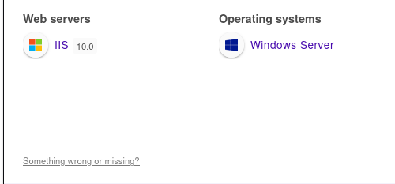

OS : Windows 10 / Server 2019 Build 17763 x64
IP : 10.10.248.64
DOAMIN :  
FQDN :

OPEN PORTS :

Open 10.10.248.64:53
Open 10.10.248.64:80
Open 10.10.248.64:88
Open 10.10.248.64:135
Open 10.10.248.64:139
Open 10.10.248.64:389
Open 10.10.248.64:445
Open 10.10.248.64:464
Open 10.10.248.64:593
Open 10.10.248.64:636
Open 10.10.248.64:3389
Open 10.10.248.64:5357
Open 10.10.248.64:7990
Open 10.10.248.64:9389

ENUMERATION  :

a web server is used : 

IIS 10.0 

