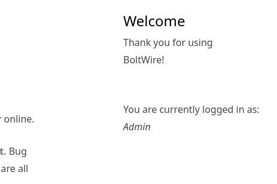

ip ==>192.168.116.199

OPEN-PORTS 

PORT     STATE SERVICE
22/tcp   open  ssh                   OpenSSH 7.9p1 Debian 10+deb10u2 (protocol 2.0)
80/tcp   open  http                  Apache httpd 2.4.38 ((Debian))    Bolt - Installation error
111/tcp  open  rpcbind          rpcbind 2-4 (RPC #100000)
2049/tcp open  nfs
8080/tcp open  http-proxy         Apache httpd 2.4.38 ((Debian))

ENUMERATION===>

port= 2049 =⇒ nfs

got a file after mounting a /srv/nfs share 
which might be a ssh private key:

port 80: 

a configuration error: or port 80

it seems a bolt software is installed on target :

so i enumerate a little bit : a directory indexing is displayed :

and contains some config files : i got some interesting info in one of them:

and i test these creds on port 8080 and login as admin

and Bolwire verion is ::::    6.03

i try to find public exploits : and i got to know that it is vuln to LFI:

and get this : 
<http://192.168.12.199:8080/dev/index.php?action.search&action=../../../../../etc/passwd>

username ⇒    jeanpaul

so i crack save.zip   from nfs   via zip2john    and got ssh private key to login

and Passphrase of id_rsa = I_love_java
now we have username and private key as well so 
lets get initial foothold :

NOw Privilage escalation : 

we can see that zip  binary has  sudo rights : 
so try to exploit that :  to get root shell :

we did it : 

NOW POST exploitation : 

dumping /etc/shadow

2. creating a new user : 
and add that to sudoers group 

hacked:hacked123 

3. clear all log files : 

DONE :

