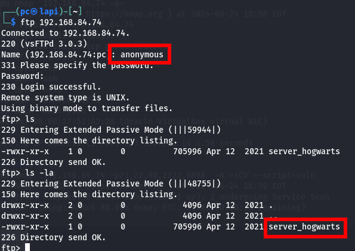
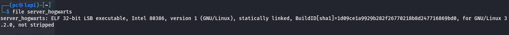
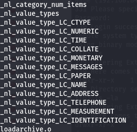
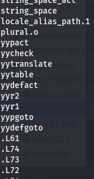
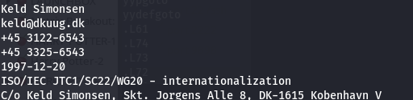
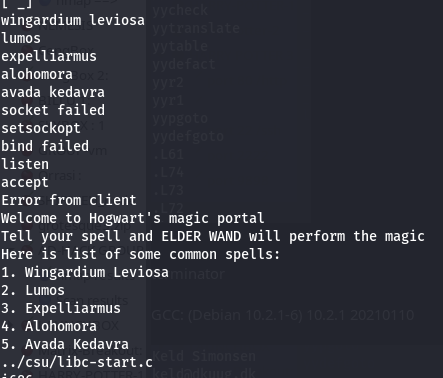

21/tcp   open  ftp        vsftpd 3.0.3
| vulners: 
|   cpe:/a:vsftpd:vsftpd:3.0.3: 
|     	PRION:CVE-2021-3618	5.8	<https://vulners.com/prion/PRION:CVE-2021-3618>
|_    	PRION:CVE-2021-30047	5.0	<https://vulners.com/prion/PRION:CVE-2021-30047>

okay anonymous access is allowed :

is ans executable : 

terminator

GCC: (Debian 10.2.1-6) 10.2.1 20210110

[/proc/self/exe](file L3Byb2Mvc2VsZi9leGU=)

