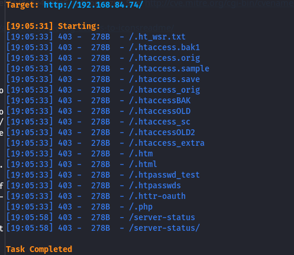
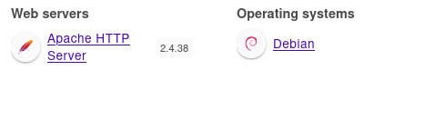

80/tcp   open  http       Apache httpd 2.4.38 ((Debian))
|_http-server-header: Apache/2.4.38 (Debian)
|_http-stored-xss: Couldn't find any stored XSS vulnerabilities.
|_http-dombased-xss: Couldn't find any DOM based XSS.
| vulners: 
|   cpe:/a:apache:http_server:2.4.38: 

todo -> 
dir busting
vhost fuzzing
source code
web explore
endpoints
dir indexing

etc>

nikto :=======>
+ Server: Apache/2.4.38 (Debian)
+ /: The anti-clickjacking X-Frame-Options header is not present. See: <https://developer.mozilla.org/en-US/docs/Web/HTTP/Headers/X-Frame-Options>
+ /: The X-Content-Type-Options header is not set. This could allow the user agent to render the content of the site in a different fashion to the MIME type. See: <https://www.netsparker.com/web-vulnerability-scanner/vulnerabilities/missing-content-type-header/>
+ No CGI Directories found (use '-C all' to force check all possible dirs)
+ Apache/2.4.38 appears to be outdated (current is at least Apache/2.4.54). Apache 2.2.34 is the EOL for the 2.x branch.
+ /: Server may leak inodes via ETags, header found with file /, inode: 61, size: 5bf5c5e4e96a6, mtime: gzip. See: <http://cve.mitre.org/cgi-bin/cvename.cgi?name=CVE-2003-1418>
+ OPTIONS: Allowed HTTP Methods: GET, POST, OPTIONS, HEAD .
+ /icons/README: Apache default file found. See: <https://www.vntweb.co.uk/apache-restricting-access-to-iconsreadme/>
+ 8102 requests: 0 error(s) and 6 item(s) reported on remote host
+ End Time:           2024-06-24 19:05:45 (GMT-4) (14 seconds)
---------------------------------------------------------------------------
+ 1 host(s) tested

dir busting : nothing

vhost fuzzing :

techused :

webserver :

