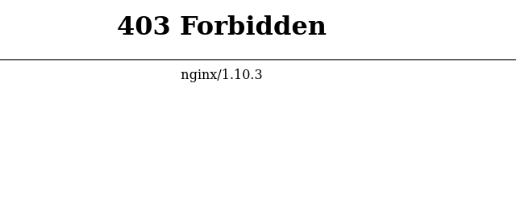
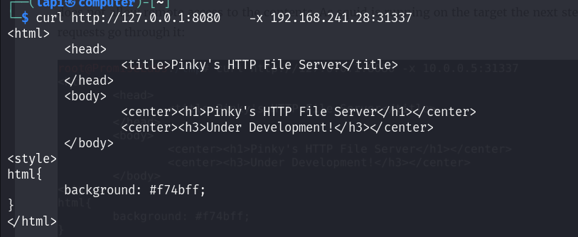
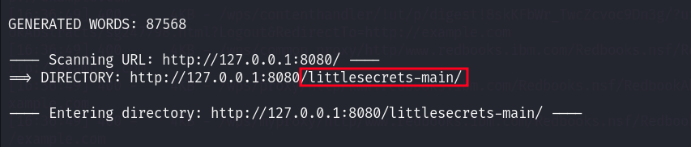
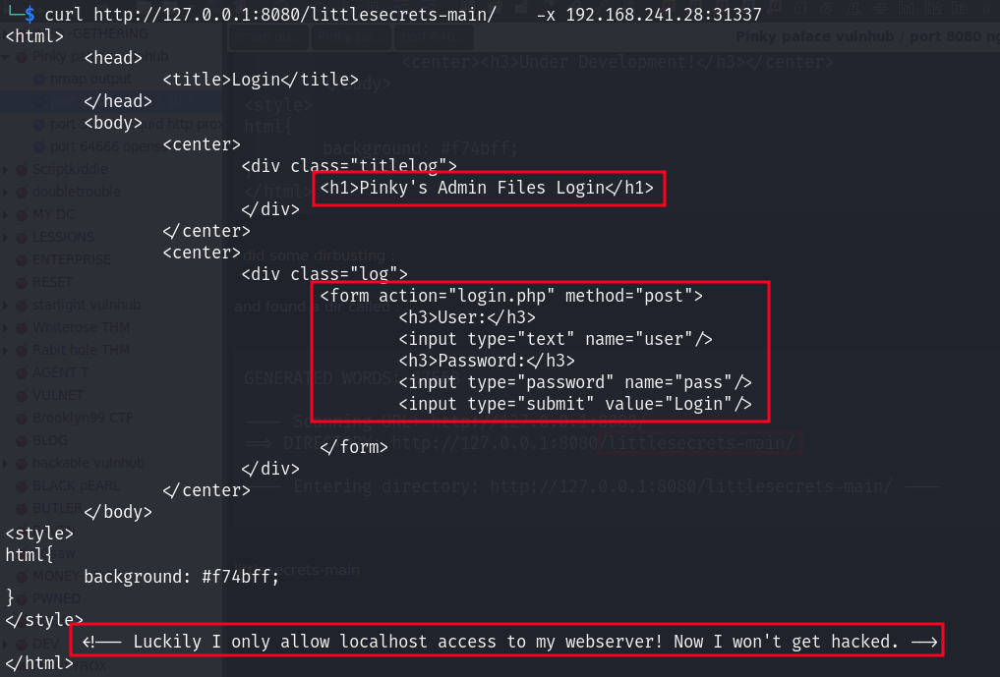
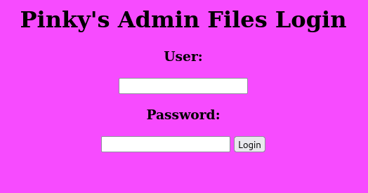
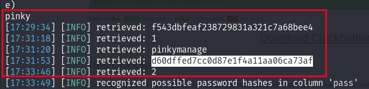

to do :

source code enum
dir busting
vhosting
param find via burp & scan with it

so we can't access any files on a nginx server so i tried to access it by ::::   squid proxy runnnig on 31337

curl   <http:///127.0.0.1:8080>  -x 192.168.241.28:31337

we can see there is file server running on localhost

i did some dirbusting :

and found a dir called :

littlesecrets-main

there is admin login pannel but how we access it :

I setup the proxy setting on foxy proxy :

so lets perform sql injection :

it is vulnerable to timebased sql injection 

pinky : f543dbfeaf238729831a321c7a68bee4

pinkymanage : 3pinkysaf33pinkysaf3

 

