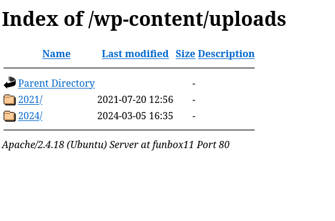

ip → 192.168.59.93

a webserver is running → on port 80 -→  a CMS =  wordpress → 

OPEN-PORTS -- >
PORT    STATE SERVICE
21/tcp  open  ftp
22/tcp  open  ssh
25/tcp  open  smtp
80/tcp  open  http
110/tcp open  pop3
139/tcp open  netbios-ssn
143/tcp open  imap
445/tcp open  microsoft-ds
MAC Address: 08:00:27:69:34:91 (Oracle VirtualBox virtual NIC)

TECH-USED -→ 
<http://192.168.59.93> [200 OK] Apache[2.4.18], Country[RESERVED][ZZ], HTML5, HTTPServer[Ubuntu Linux][Apache/2.4.18 (Ubuntu)], IP[192.168.59.93], JQuery[3.7.1], MetaGenerator[WordPress 6.4.3], Script[text/javascript], Title[Funbox: Scriptkiddie], UncommonHeaders[link], WordPress[6.4.3]

ENUMERATION -→ 

port 21 → 
anonymous login ok , but we need password to access it ..

port 445 → 
[*] Detected 1 hosts serving SMB
[*] Established 1 SMB session(s)                                
                                                                                                    
[+] IP: 192.168.59.93:445	Name: funbox11            	Status: Authenticated
	Disk                                                  	Permissions	Comment
	----                                                  	-----------	-------
	print$                                            	NO ACCESS	Printer Drivers
	IPC$                                              	NO ACCESS	IPC Service (funbox11 server (Samba, Ubuntu))

port 80 -->

a wordpress site is runnning → 
wordpress verion --<  6.4.3 

username →  admin 

directory listing is enabled -->< 

but gives nothing → 

