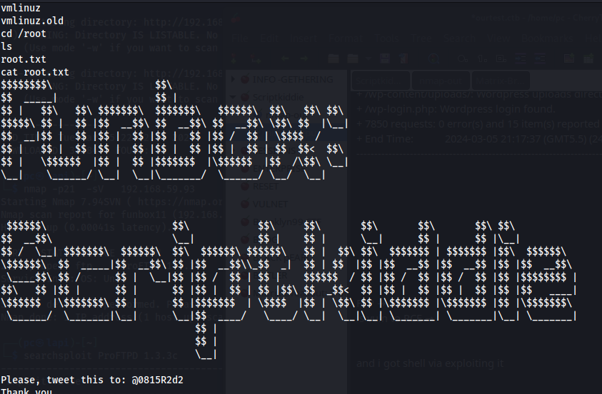

- Nikto v2.5.0
---------------------------------------------------------------------------
+ Target IP:          192.168.59.93
+ Target Hostname:    funbox11
+ Target Port:        80
+ Start Time:         2024-03-05 21:17:13 (GMT5.5)
---------------------------------------------------------------------------
+ Server: Apache/2.4.18 (Ubuntu)
+ /: The anti-clickjacking X-Frame-Options header is not present. See: <https://developer.mozilla.org/en-US/docs/Web/HTTP/Headers/X-Frame-Options>
+ /: Drupal Link header found with value: <<http://funbox11/index.php/wp-json/>>; rel="<https://api.w.org/>". See: <https://www.drupal.org/>
+ /: The X-Content-Type-Options header is not set. This could allow the user agent to render the content of the site in a different fashion to the MIME type. See: <https://www.netsparker.com/web-vulnerability-scanner/vulnerabilities/missing-content-type-header/>
+ /index.php?: Uncommon header 'x-redirect-by' found, with contents: WordPress.
+ No CGI Directories found (use '-C all' to force check all possible dirs)
+ Apache/2.4.18 appears to be outdated (current is at least Apache/2.4.54). Apache 2.2.34 is the EOL for the 2.x branch.
+ /: Web Server returns a valid response with junk HTTP methods which may cause false positives.
+ /icons/README: Apache default file found. See: <https://www.vntweb.co.uk/apache-restricting-access-to-iconsreadme/>
+ /wp-content/plugins/akismet/readme.txt: The WordPress Akismet plugin 'Tested up to' version usually matches the WordPress version.
+ /wp-links-opml.php: This WordPress script reveals the installed version.
+ /license.txt: License file found may identify site software.
+ /: A Wordpress installation was found.
+ /wp-login.php?action=register: Cookie wordpress_test_cookie created without the httponly flag. See: <https://developer.mozilla.org/en-US/docs/Web/HTTP/Cookies>
+ /wp-content/uploads/: Directory indexing found.
+ /wp-content/uploads/: Wordpress uploads directory is browsable. This may reveal sensitive information.
+ /wp-login.php: Wordpress login found.
+ 7850 requests: 0 error(s) and 15 item(s) reported on remote host
+ End Time:           2024-03-05 21:17:37 (GMT5.5) (24 seconds)
---------------------------------------------------------------------------

FTP →    1.3.3rc 
is vuln to RCE → 

and i got shell via exploiting it 

and got root accesssss→ 

