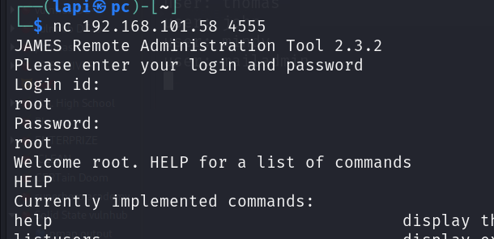
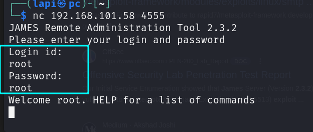
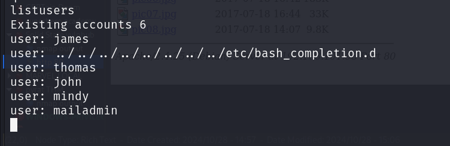
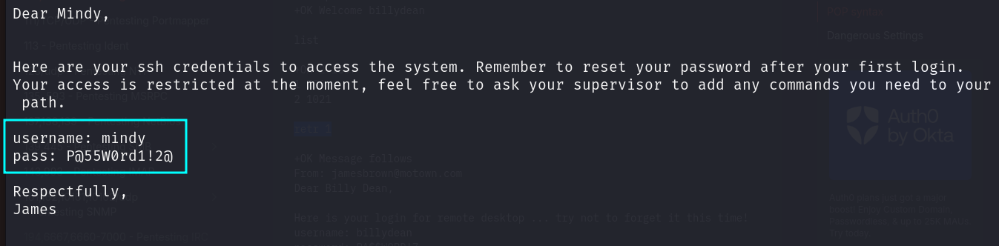
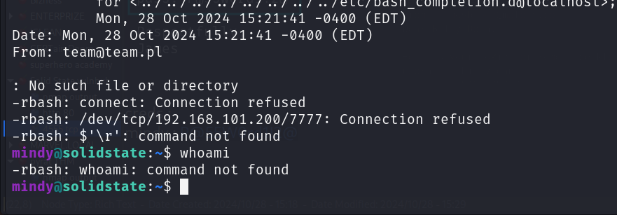

james remote administration tool is running : version 2.3.2

i loged in via using default credss :

all exixting users 

i change the password of mindy user and login into pop3 via that user and read her messeges :

creds : 
mindy : P@55W0rd1!2@

we are inside :

found user.txt

