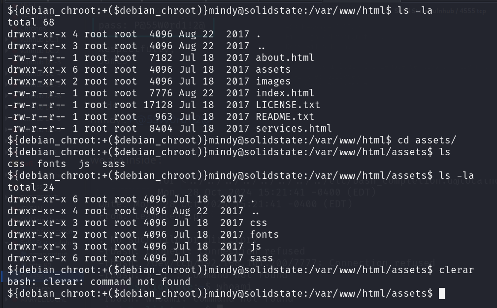

we are login as restricted shell :

only cat , env , ls are enable :

lets try to bypass this annoying restricted shell:

and we did it :

via this :

ssh mindy@192.168.101.58 -t "bash --noprofile"

post enumertaion :

users :

sudo -l : sudo not foundt

SUIDS :

james /home dir :

/opt :

there is a file tmp.py : and we can read that execute that or even have write permission :

nothing in : /var/www

lets run lpspy

and some files is running ;

okay we can do something about it :

/opt/tmp.py running as cronjob and we have rwx access to that file  so we can place our malicious file there
and can get root shell:

 

root.txt

