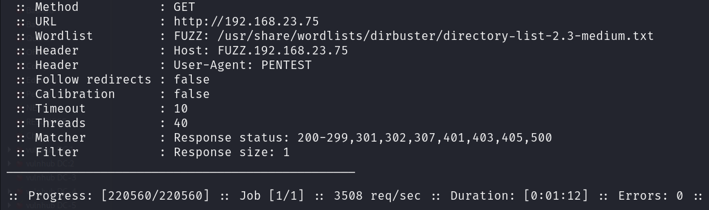

okay after enumerating ftp :  lets do some web app enum :

this is response we got on wepapp running .

sourcecode :

has nothing ;

dirbusting : we got some dir :

hidden ones :

they are downloadable :

i found some dir : they have nothing :

vhosting:

dont have nothing:

  

that is a php server : hence files might be end with .php right ??

