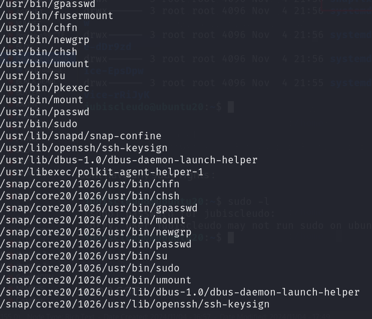
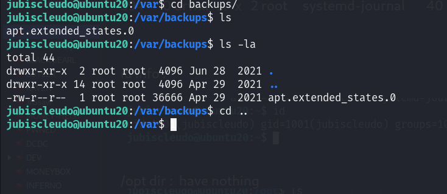
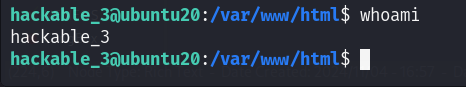
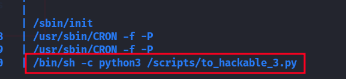

IP : 

OPEN_PORTS:
PORT   STATE    SERVICE VERSION
22/tcp filtered ssh
80/tcp open     http    Apache httpd 2.4.46 ((Ubuntu))
|_http-title: Kryptos - LAN Home
| http-robots.txt: 1 disallowed entry 
|_/config
|_http-server-header: Apache/2.4.46 (Ubuntu)

port 80 enum:

to-dos=>
1. dirbusting
2. vhosthing
3. source code enum
4. test all params via burpsuite for common vulns like lfi , rfi , sql , xss , OS cmd inj .etc
5. Manual enumeration

this is aa website running:

in source code i found a clue :

jubiscleudo    => .jpg file
dev_suport@hackable3.com

this is the login page and 

and its tech_stack

apache : 2.4.46
jquery : 3.3.1

in robots.txt i found something:

it has a file called 1.txt

a bas64 endoing:

and its a port no.
 

to hit the right port and discovered the port we need ports of three combination :

80 10000   

dirbutsing:

some interesting dir we found out :

and /css/2.txt  

data is encoded with brainfuck  
its is second port :

10000 4444

after i tried some creds on login page admin:admin workds 
and i get a php script :

i fond 3.jpg and also extract third port via stegnopgraphy

now port 22 is also open ;

we have a wordlist from /backup dir :

lets do some ssh bruteforcing:

and i found something:

jubiscleudo : onlymy

NOW LETS START PRIVILEGE ESCALATION:

network interfaces :

users on system:

hackable_3
jubidcleudo : onlymy

kernel info :

routing table :

arp table :

dont have permisssion to view : hackable_3 user /home dir ::

/tmp dir:

dont have any sudo rights :

SUID & SGID:
nothing interseting in SUID :

SGID :
can have intersting:
jubiscleudo@ubuntu20:~$ find / -perm /2000 -ls 2>/dev/null
   394653      4 drwxrwsr-x   2 root     mail         4096 Apr 21  2021 /var/mail
   395072      4 drwxr-sr-x   3 root     systemd-journal     4096 Apr 27  2021 /var/log/journal
   401634      4 drwxr-sr-x   2 root     systemd-journal     4096 Nov  4 22:42 /var/log/journal/7d693ead326949a6bb91a6600cd9756f
   394651      4 drwxrwsr-x   2 root     staff               4096 Apr 19  2021 /var/local
   918098     44 -rwxr-sr-x   1 root     crontab            43720 Mar 15  2021 /usr/bin/crontab
   918163     32 -rwxr-sr-x   1 root     shadow             31312 Jan  7  2021 /usr/bin/expiry
   918719     36 -rwxr-sr-x   1 root     tty                35200 Feb 26  2021 /usr/bin/wall
   918595    256 -rwxr-sr-x   1 root     ssh               260376 Mar 23  2021 /usr/bin/ssh-agent
   918063     84 -rwxr-sr-x   1 root     shadow             84512 Jan  7  2021 /usr/bin/chage
   918732     24 -rwxr-sr-x   1 root     tty                22920 Feb 26  2021 /usr/bin/write.ul
  1054470     16 -rwxr-sr-x   1 root     utmp               14488 Dec  5  2020 /usr/lib/x86_64-linux-gnu/utempter/utempter
   924582     44 -rwxr-sr-x   1 root     shadow             43168 Aug  6  2020 /usr/sbin/pam_extrausers_chkpwd
   924634     44 -rwxr-sr-x   1 root     shadow             43160 Aug  6  2020 /usr/sbin/unix_chkpwd
      793     83 -rwxr-sr-x   1 root     shadow             84512 May 28  2020 /snap/core20/1026/usr/bin/chage
      854     31 -rwxr-sr-x   1 root     shadow             31312 May 28  2020 /snap/core20/1026/usr/bin/expiry
     1080    343 -rwxr-sr-x   1 root     crontab           350504 Mar  9  2021 /snap/core20/1026/usr/bin/ssh-agent
     1166     35 -rwxr-sr-x   1 root     tty                35048 Jul 21  2020 /snap/core20/1026/usr/bin/wall
     7169     43 -rwxr-sr-x   1 root     shadow             43168 Jul 21  2020 /snap/core20/1026/usr/sbin/pam_extrausers_chkpwd
     7213     43 -rwxr-sr-x   1 root     shadow             43160 Jul 21  2020 /snap/core20/1026/usr/sbin/unix_chkpwd
    11700      0 drwxrwsr-x   2 root     mail                   3 Apr 29  2021 /snap/core20/1026/var/mail
     1637     34 -rwxr-sr-x   1 root     shadow             34816 Jul 21  2020 /snap/core18/1997/sbin/pam_extrausers_chkpwd
     1666     34 -rwxr-sr-x   1 root     shadow             34816 Jul 21  2020 /snap/core18/1997/sbin/unix_chkpwd
     1703     71 -rwxr-sr-x   1 root     shadow             71816 Mar 22  2019 /snap/core18/1997/usr/bin/chage
     1748     23 -rwxr-sr-x   1 root     shadow             22808 Mar 22  2019 /snap/core18/1997/usr/bin/expiry
     1924    355 -rwxr-sr-x   1 root     crontab           362640 Mar  4  2019 /snap/core18/1997/usr/bin/ssh-agent
     1988     31 -rwxr-sr-x   1 root     tty                30800 Sep 16  2020 /snap/core18/1997/usr/bin/wall
    10782      0 drwxrwsr-x   2 root     mail                   3 Mar  9  2021 /snap/core18/1997/var/mail
     1639     34 -rwxr-sr-x   1 root     shadow             34816 Apr  8  2021 /snap/core18/2074/sbin/pam_extrausers_chkpwd
     1668     34 -rwxr-sr-x   1 root     shadow             34816 Apr  8  2021 /snap/core18/2074/sbin/unix_chkpwd
     1705     71 -rwxr-sr-x   1 root     shadow             71816 Mar 22  2019 /snap/core18/2074/usr/bin/chage
     1750     23 -rwxr-sr-x   1 root     shadow             22808 Mar 22  2019 /snap/core18/2074/usr/bin/expiry
     1926    355 -rwxr-sr-x   1 root     crontab           362640 Mar  4  2019 /snap/core18/2074/usr/bin/ssh-agent
     1990     31 -rwxr-sr-x   1 root     tty                30800 Sep 16  2020 /snap/core18/2074/usr/bin/wall
    10795      0 drwxrwsr-x   2 root     mail                   3 Jun 11  2021 /snap/core18/2074/var/mail
      594      0 drwxr-sr-x   2 root     systemd-journal       40 Nov  4 21:55 /run/log/journal
      
      
      
      id info :
      
      
      
      /opt dir :  have nothing
      
      
      
      /var/backups have nothing:
      
      
      
      
      
      in /var/www/html has a hidden dir :
      
      
      
      it has something interesting:
      
      
      
      hackable_3 : TrOLLED_3
      
      
      work as perfect :
      
      
      
      nothing is /home or .bash_history
      
      
      
      
      
      network info :
      
      nothing is here :
      
      
      nope no one belogs to sudoers group:
      
      
      
      
      i enumerate almost everything but noting finds :  
      
      look for anyservices : via pspy 
      
      
      
      
      
      and after some time waithing in dark i found something:
      
      
      
     oh  im so dump i missed this dir : in / root 
     
     
     
     but file is not present there so we can create python reverse shell with that name and it will execute we can get root shell:
     
     and i did it :
     
user.txt  in  /home/jubiscleudo 
      
     
     
     
     
     
     
     
       

