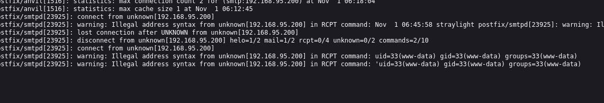

to-dos:

1.dirbusting
2.vhosting
3.source code enum
4. manual exploration with burp

tech_stack :

ntopng is running :

its is a traffic monitoring framework :

dirbusting :
nothing :

vhosting:
nothing not any other vhost:

we are in using default creds :;

version no :  

client open ports :

i change the interface to localhost and see the flows of traffic and we can see there are two dir here :

/turing-bolo
/freeside

this web app is running :

found some clues :

might be a  pass :

another one :

case : 

and we can read log files: from bolo paremeter

lets try smtp log poisining:  to get php rce

and i get rce :

and i get initial foothold:

