users :

id :

wintermute dir :

turning-police dir :

/opt dir :

it is a dual homed network:

we have 2nics :
that means we have to piviting to access second machine:

kernel version :

some  root scripts:

netstat info :

redis file :

screen suid binary :

we exploit screen binary and get root :

we find a flag.txt

and note.txt

3Jane
tomcat server 
/struts2_2.3.15.1-showcase

now we can see this machine is dual homed that means we stiil need to do piviting :

lets try ligolong if not works we will use meterpreter

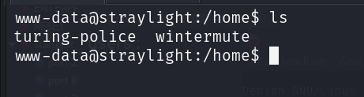
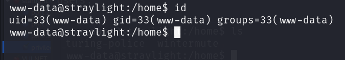
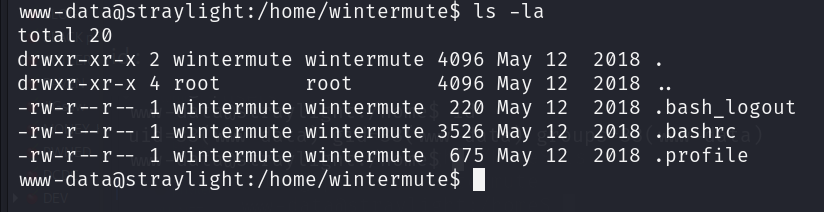
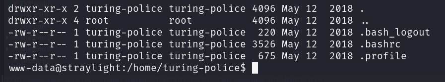
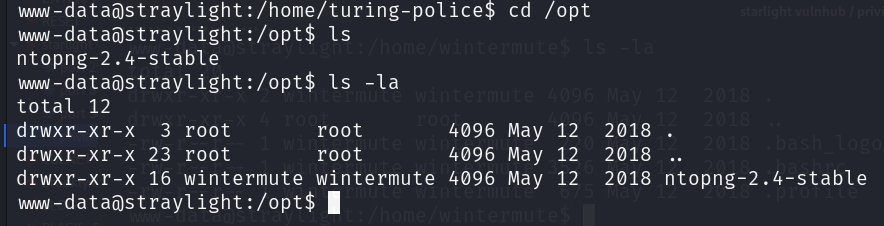
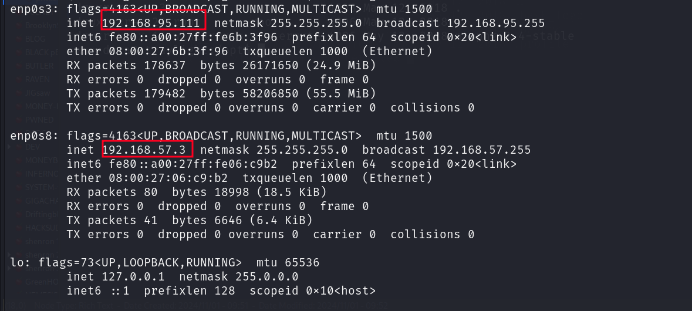
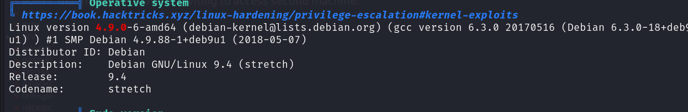
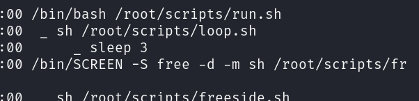
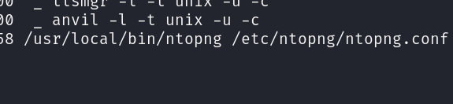
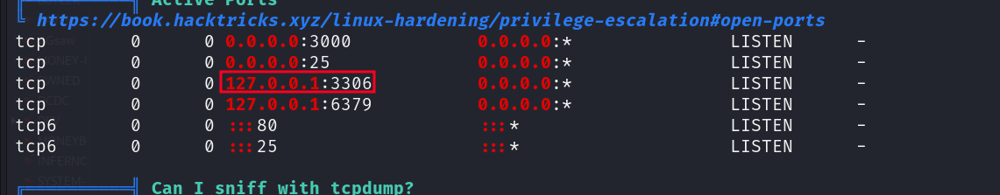
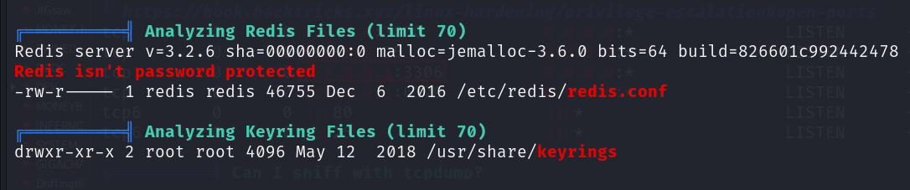
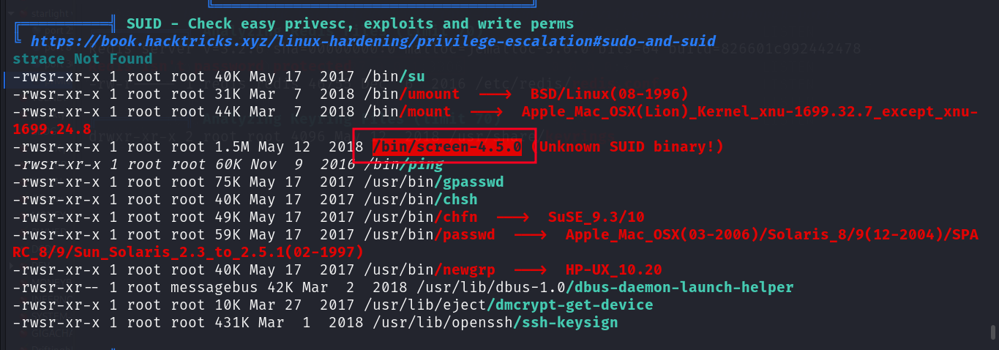
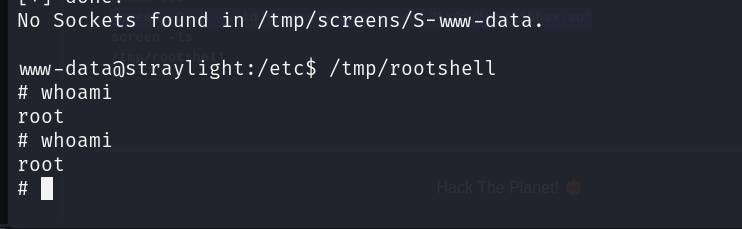
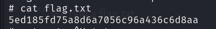
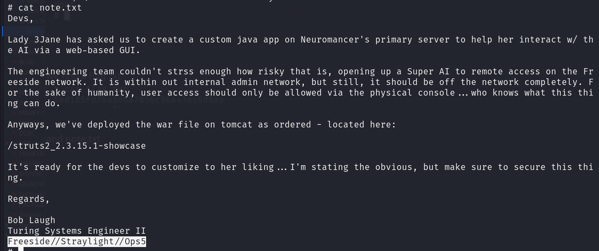
