80/tcp open  http    nginx 1.15.10
|_http-title: System Tools
|_http-server-header: nginx/1.15.10

tech used: on website:

a login page is 

dire busting:

nothing found

vhosting we found nothing:

sql injection is not found:

lets try for command injection:

command injection is also not found

after a lot of recon and trial and eror i decided to go for brute force attack and i got something:

there is some functionality here :

i intercept request and lets do some changes in it :

we have command injection guys:

getting a reverse shell:

PRIVILEGE escalation:

1. we have three usernames:

charles have nothing:

jim has a backup dir :

it has old passwd list:

lets do ssh brute forcing :

we got a hit

jim:jibril04

i do some recon and i read a mail in the system for jim:

found a passwd for charles:

charles : ^xHhA&hvim0y

okay now we have some sudo -l

we can append a new use and passwd in /etc/passwd file :

step 1. create a encrypted passwd:
openssl passwd -1

step 2. copy that passwd into /etc/passwd 

step 3. login as your user:

we are root :

done :

========================================================================================
learnings :

1. always try everything else before loosing yourself , even hard methods bruteforce , passwd spray etc.
2. when u have write permission as root via any command : write write in /etc/passwd file or simply read whats in /root  dir

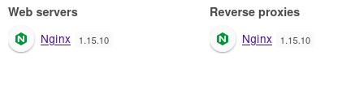
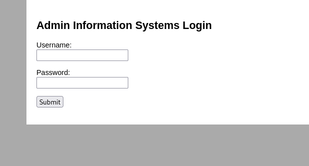
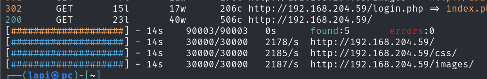
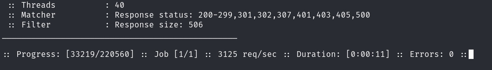
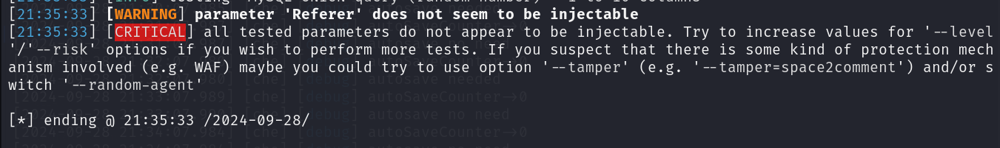
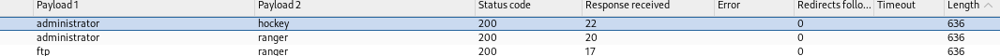
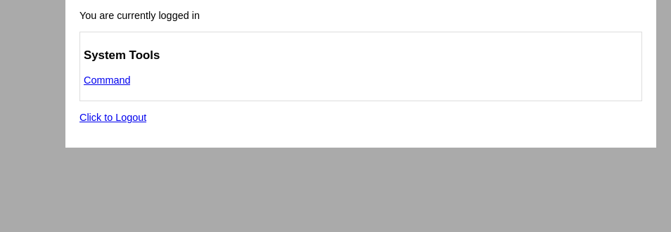
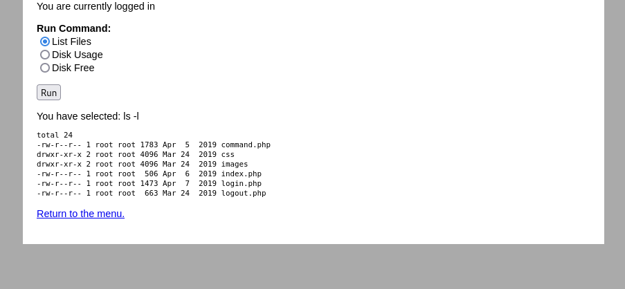
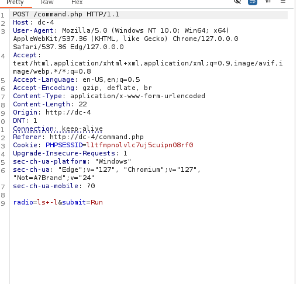
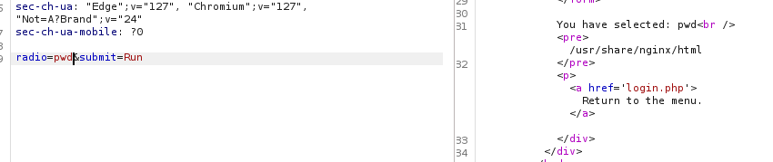
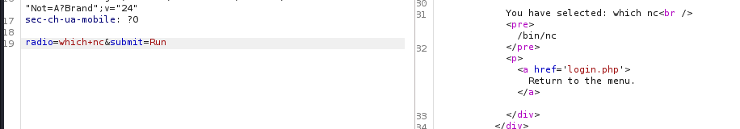
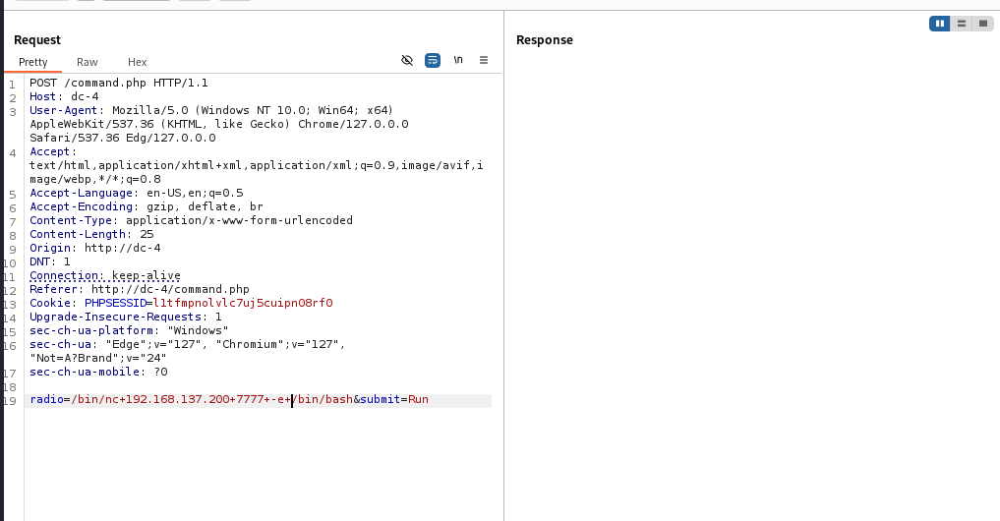
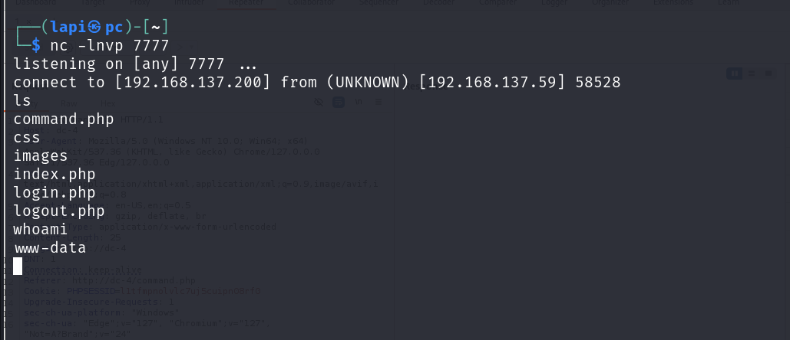
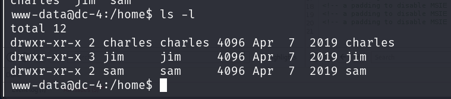
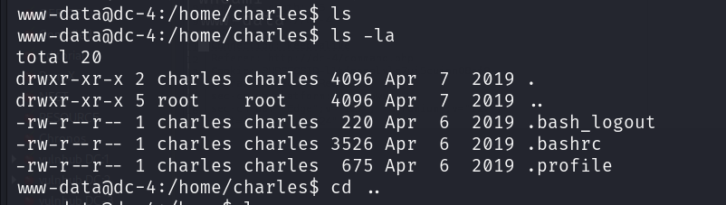
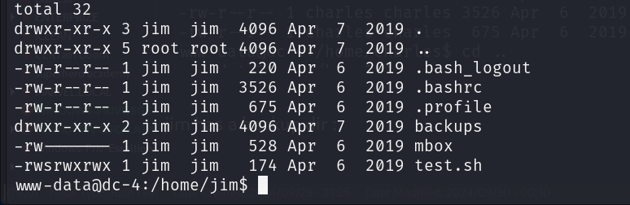
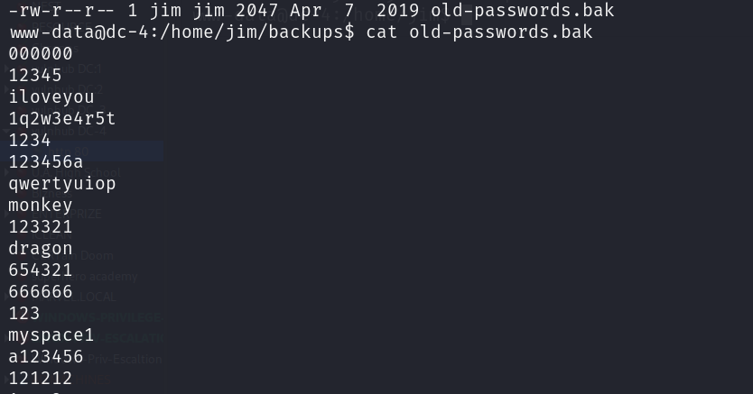
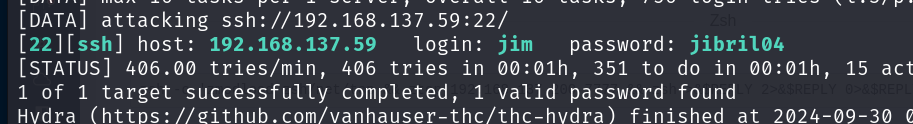
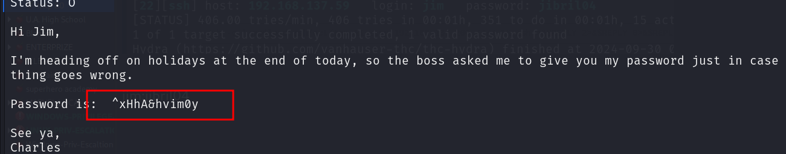
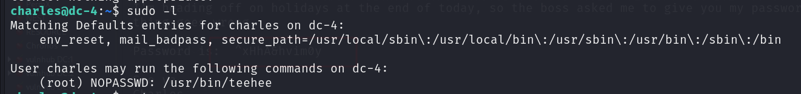
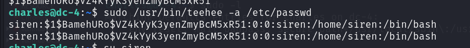
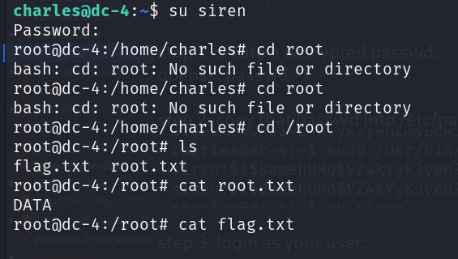
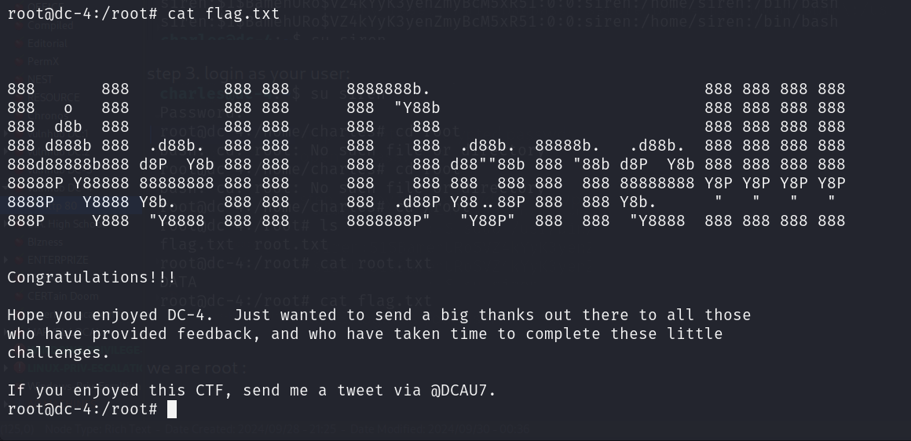
