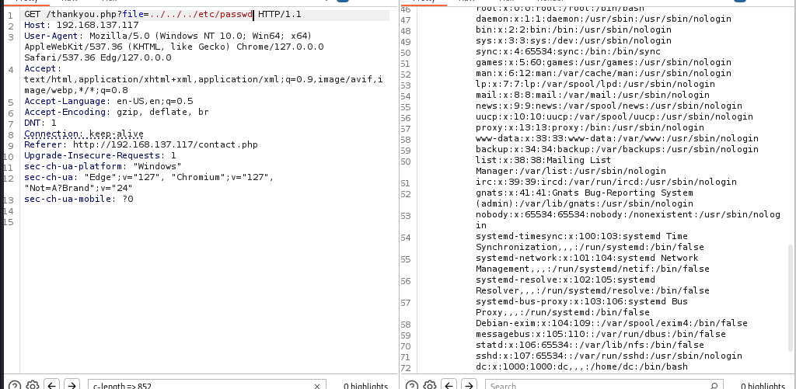

to-dolist:  

1. dirbuster
2. vhosting
3. source code enum
4. hunt for params and links via b-suite 

dirbusting:
we found some of them:

tech_stack used :

a website with nginx :

vhosting :
dont have any vhosts:

source code has nothing but usual stuff:

---------

we have a contact page with some inputs :

lets fire up b-suite and test this:

i try some else :

we have rce via nginx log poisioning:

getting a reverse shell:
step 1. findinig nc 

step 2: reverse shell:via nc 

privilege escalation:

