80/tcp open  http    Apache httpd 2.4.25 ((Debian))
|_http-title: Did not follow redirect to <http://wordy/>
|_http-server-header: Apache/2.4.25 (Debian)

add : <http://wordy> into /etc/hosts

its a wordpress site:

tech_stack used:

to-do list:
1.	dir busting
2. vhosting
3. source code enunm
4. expore with burp sute

1. dir busting:

2. users: find via wpscan

ok then i tried to brute force all of them byusing a hint i get from machines description:

mark : helpdesk01

then i enumerate website via wpscan and i found a vuln plugin is installed :

is vuln to and rce :

and lets fireup msfconsole and see it is expliotaible or not.

we get an rce :

db creds:

wpdbuser : meErKatZ

some stuff found in mark's dir:

graham : GSo7isUM1D4

has rights to run this file :

it is creating a backup of /var/ww/html

i see the permissions of the file backups.sh  is belongs to devs group 

my user graham is also belongs to devs group that means we can edit this file;

lets gets a shell as jens

okay : 

jens can execute nmap as root :

lets get root shell:

nmap doesn't have ineteractive option means its a new patched binary :

but we have a new methods also :

step 1 : create an env variable name :   TF=$(mktemp)
step2: write script into TF var  :  echo ‘os.execute("/bin/bash")’ > $TF
step3 :  execute thst script as nmap script:   sudo nmap --script=$TF

THE END 

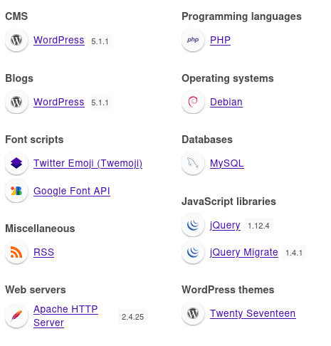
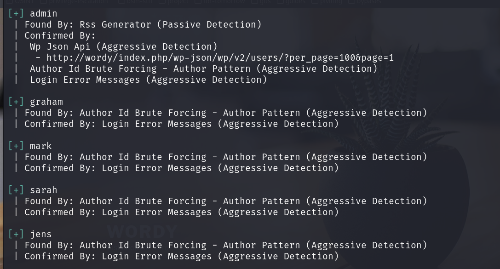
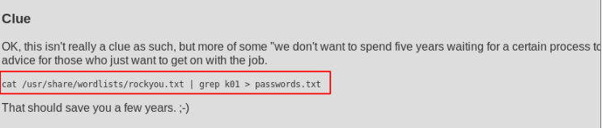
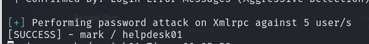
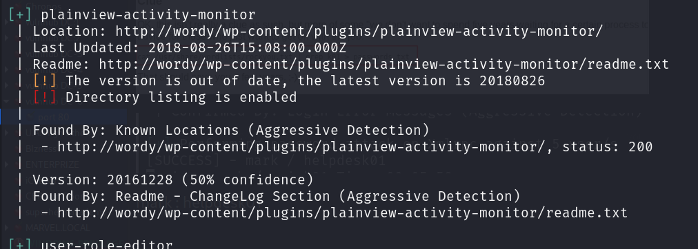
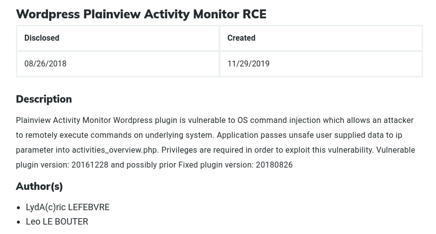
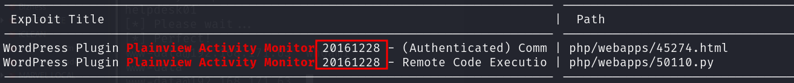
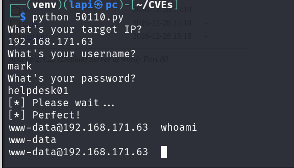
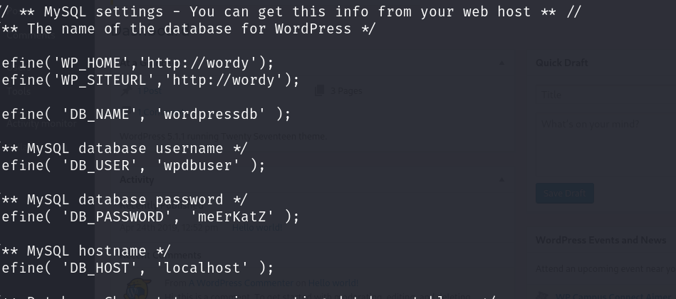
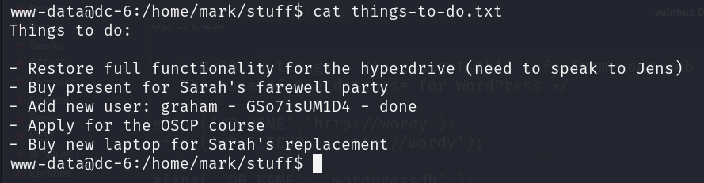
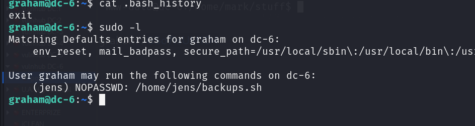
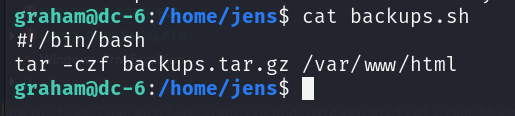
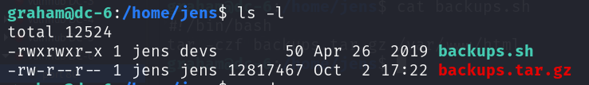
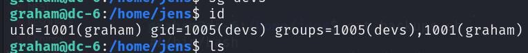
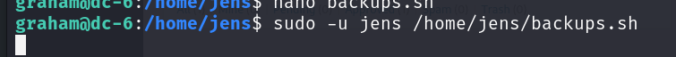
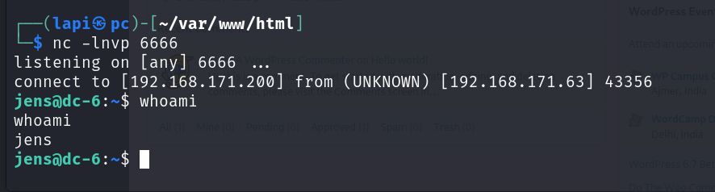
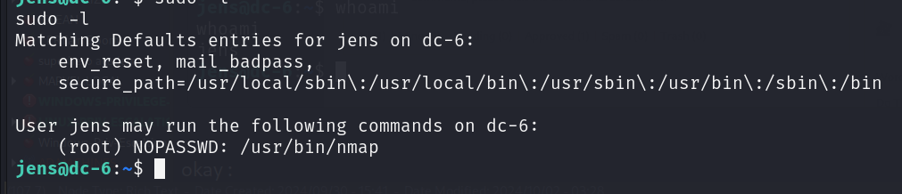
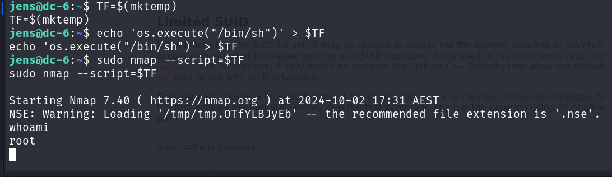
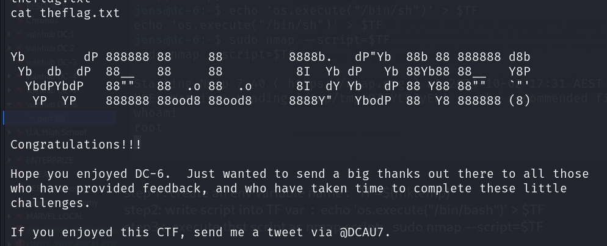
