80/tcp open  http    Apache httpd 2.4.25 ((Debian))
|_http-server-header: Apache/2.4.25 (Debian)
| http-robots.txt: 22 disallowed entries (15 shown)
| /core/ /profiles/ /README.txt /web.config /admin/ 
| /comment/reply/ /filter/tips /node/add/ /search/ /user/register/ 
| /user/password/ /user/login/ /user/logout/ /index.php/admin/ 
|_/index.php/comment/reply/
|_http-title: Welcome to DC-7 | D7
|_http-generator: Drupal 8 (<https://www.drupal.org>)
MAC Address: 08:00:27:E9:55:7F (Oracle VirtualBox virtual NIC)

drupal 8 CMS is running:
web page is running:

to-dolist:
1. dirbusting
2. vshosting
3. source code enum
4. hunt params with burp

vhosting gives nothing;

itried to brute force but it has only 5 attempts:

lockout policy is only 5 attempts

I think we have to guess the password of dc7user :

we can also try sshbruteforceingchr

after so many days of enumeration : i decided to look into walkthrough :

and then 

@DCUSER when we search that on google a githhub account is displayed

in that github account : we found something:

and in config.php we can see some creds:

and those creds are resued for ssh:

privilege: escalation:

in home dir we found some mailinig files:

THE END :

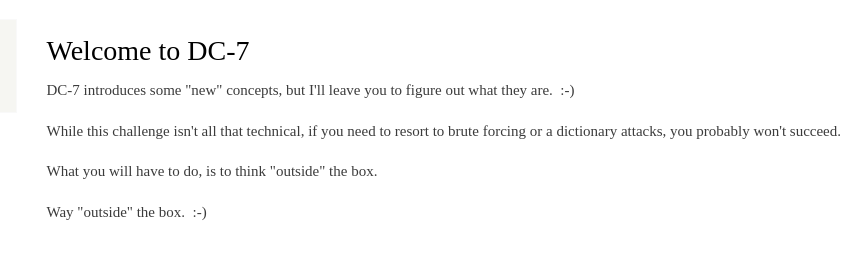
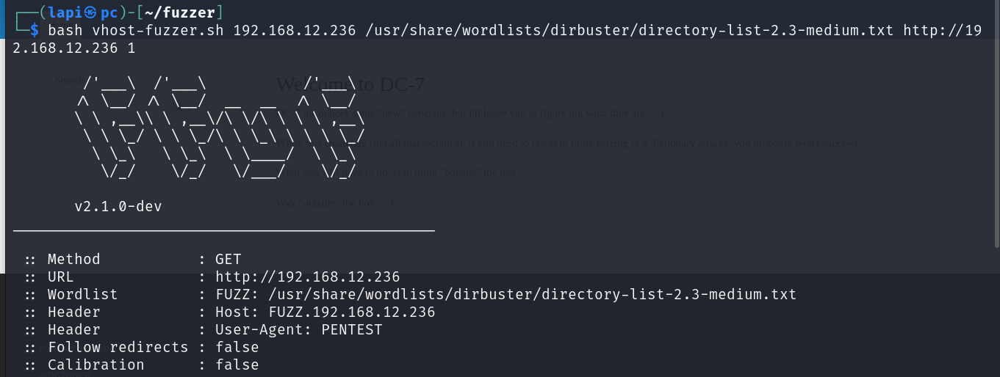
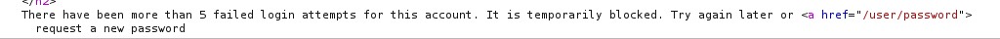

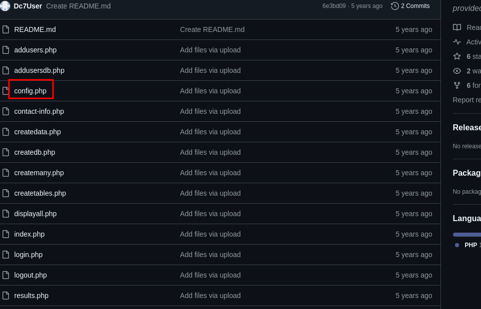
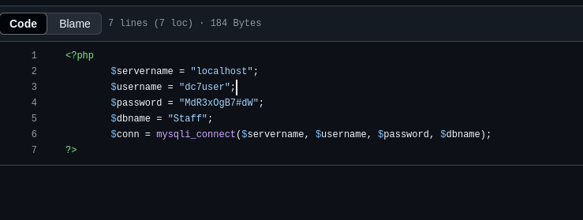
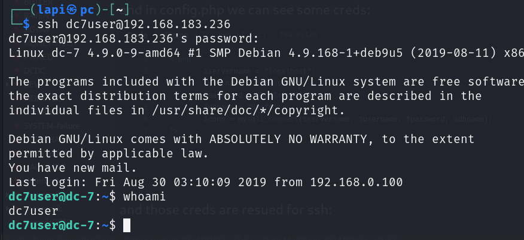
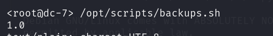
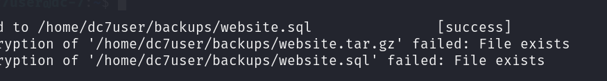
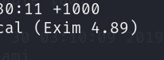
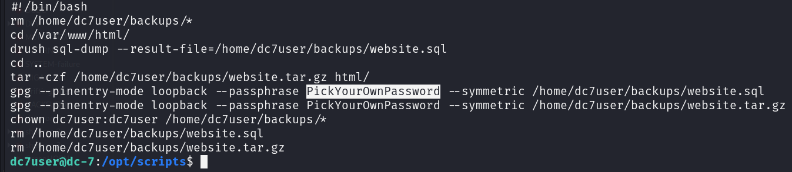
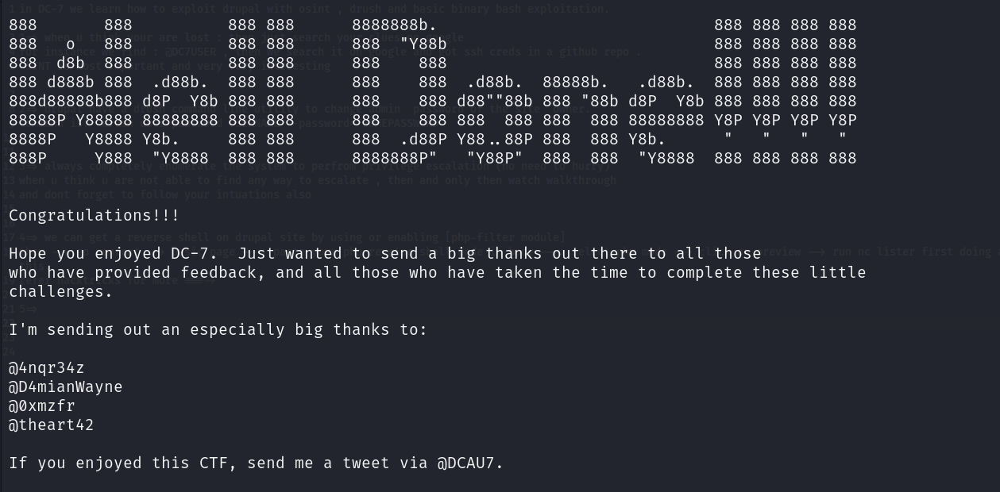
