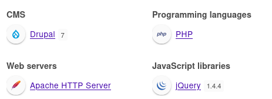
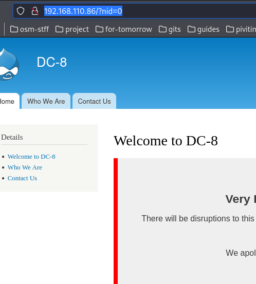
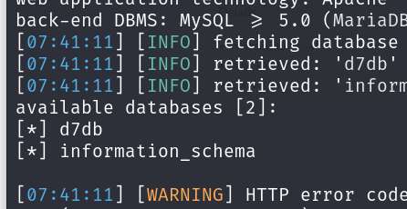
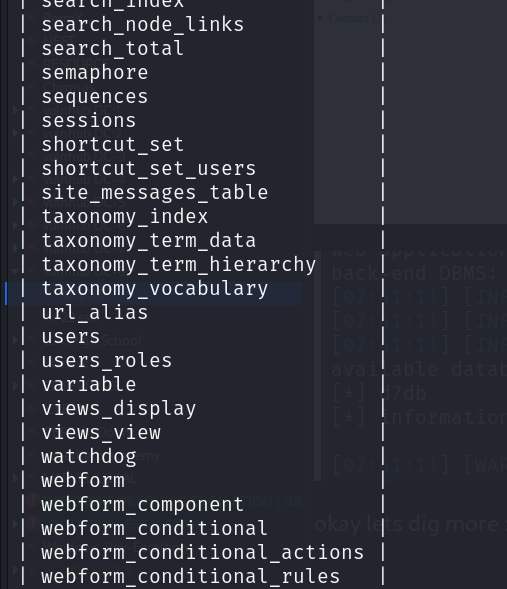
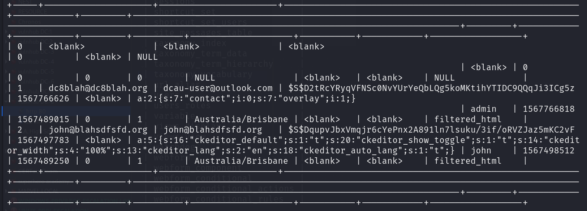
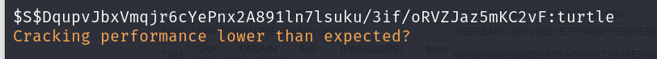
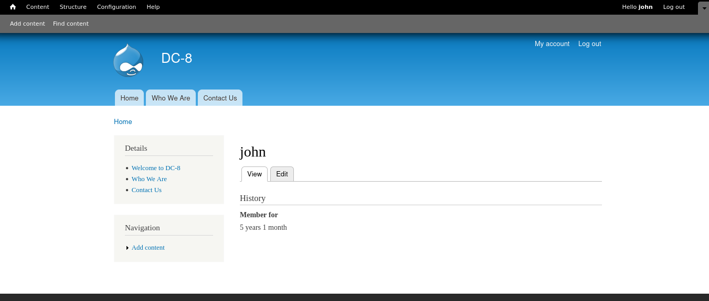
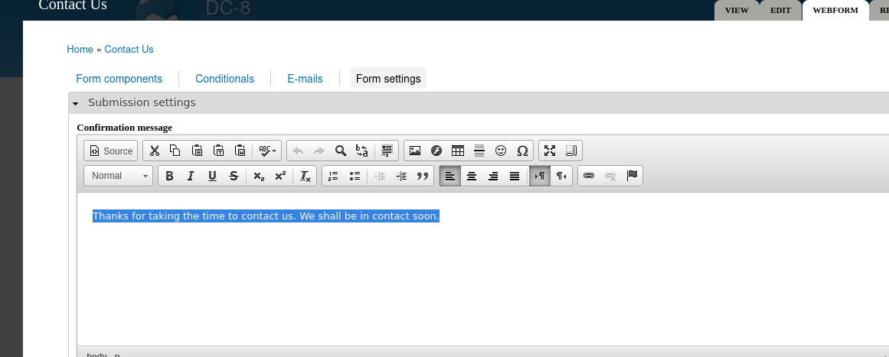
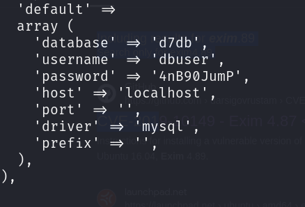

80/tcp open  http    Apache httpd
|_http-title: Welcome to DC-8 | DC-8
|_http-server-header: Apache
| http-robots.txt: 36 disallowed entries (15 shown)
| /includes/ /misc/ /modules/ /profiles/ /scripts/ 
| /themes/ /CHANGELOG.txt /cron.php /INSTALL.mysql.txt 
| /INSTALL.pgsql.txt /INSTALL.sqlite.txt /install.php /INSTALL.txt 
|_/LICENSE.txt /MAINTAINERS.txt
|_http-generator: Drupal 7 (<http://drupal.org>)

to-do list
1. dir-busting
2. virtualhosting
3. source-code exploration
4. finding hidden params via suite
5. find tech used      🆗️

tech_used:

manual-enumeration:
i just manually enumerate the site and then i found a param name nid

it has an sql injection vulnerability:

okay lets dig more :

tables:

creds :

we cracked a password:

john:turtle

first i tried to login via ssh but , not successful : i successfully login into website :

okay after some enumeration we discover that we can change form settings : then : we change format to php :

we have to edit contactus up → webform and change format to php and then we can get a reverse shell .
 
 
 
 database creds :
 
 
 

