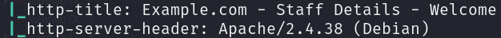
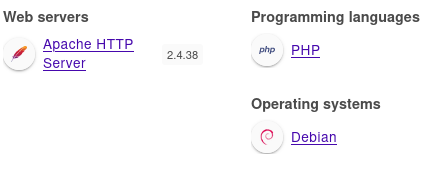
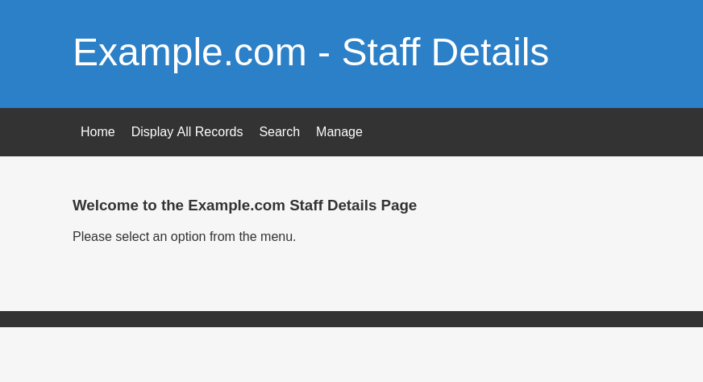
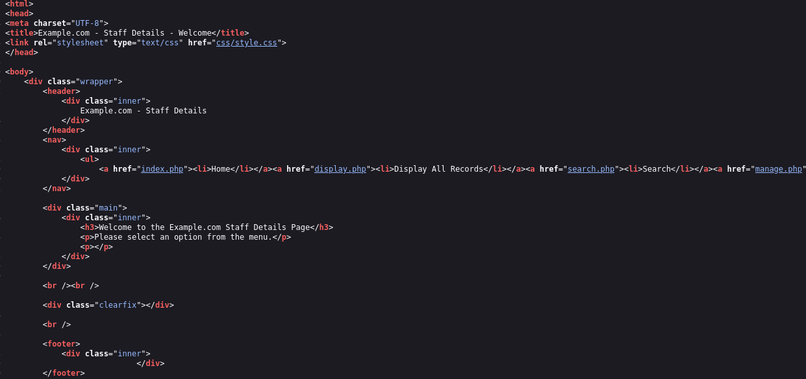
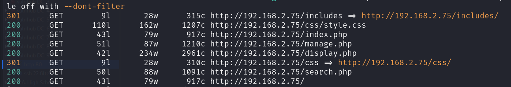
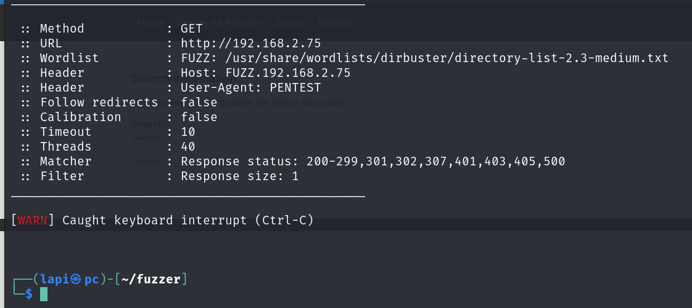
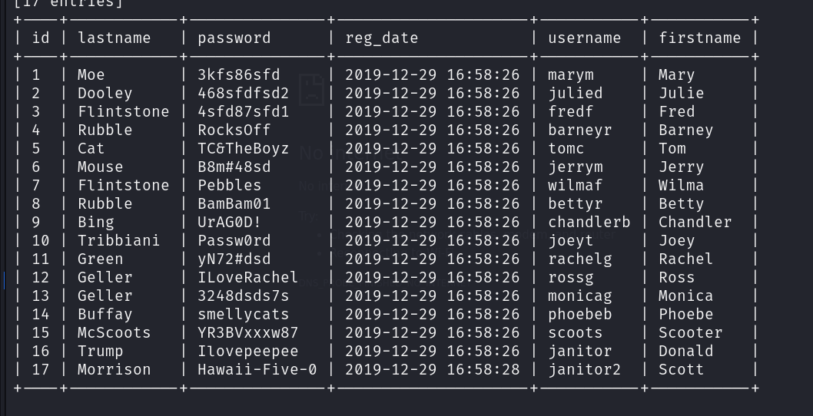
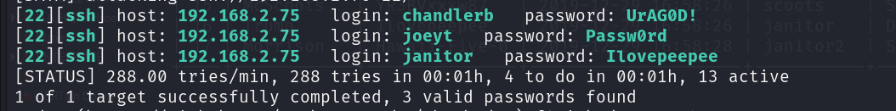

to-dos
1. dirbusting
2. vhosting
3. source-code enum 🆗️
4. hidden params via suite
5. manal explortaion

tech_used:

web  page is running 

source code have noting inetersting:

dirbusting:   well dont includes anything ineterseting

virtualhosting:

nothing interseting there is not : virtual shared hosting going on

search params is vulnerable to sql injection :

then i try bruteforcing ssh : with these credss :

i got three creds :

