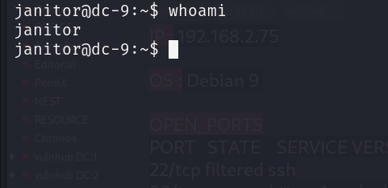
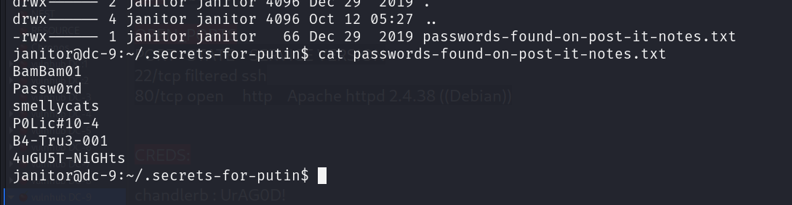
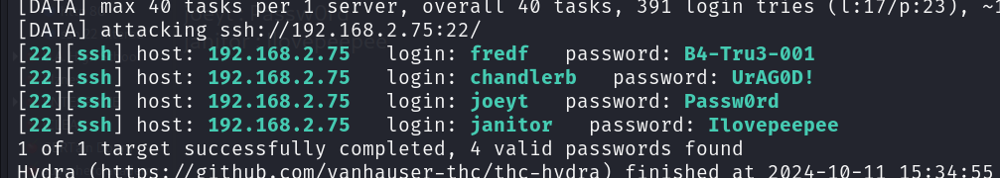
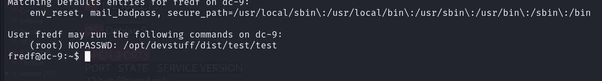
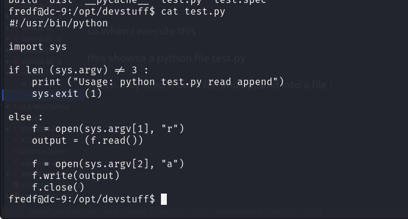
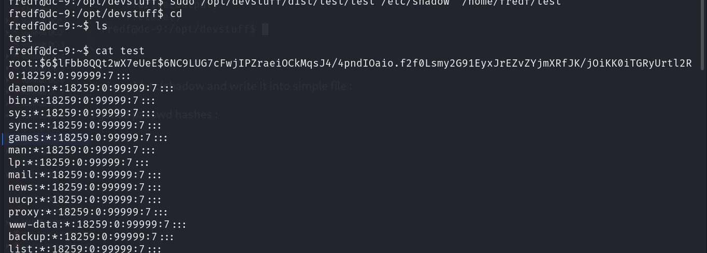
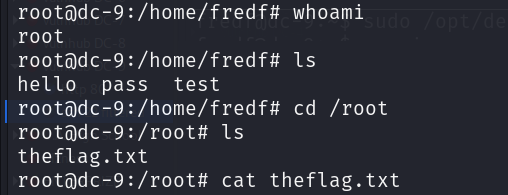
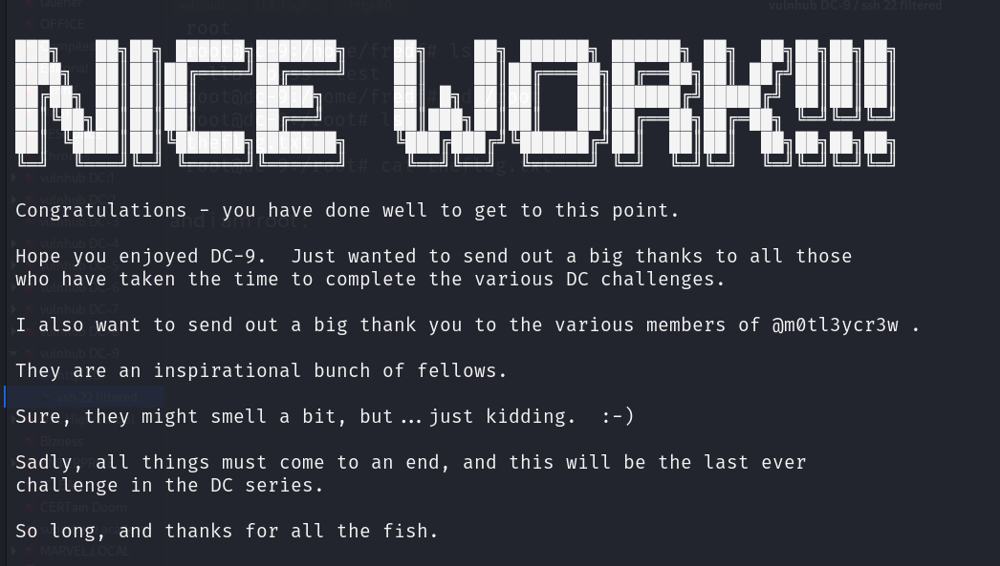
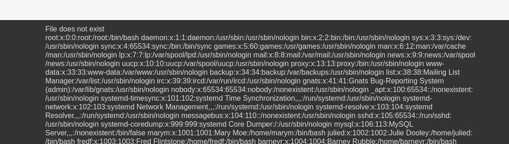

i got ssh access or initial foothold:

in janitor home we found a hidden dir and some passwds in it :

i use these passwd to again brute force : i found one extra:

i login  as fredf and fredf user has right to exeute a file as root :

so when i execute this : 

this showsa a python file test.py 

which only read from a file and appand into a file :

so i read /etc/shadow and write it into simple file : 

i get all passwd hashes :

lets try to crack the root hash:

okay 2nd approach :

we have a write capanbility as root : we can add another user who has use3r id of 1 in /etc/passwd and then login as that user :

step 1: create a user : passwd in linux format :

habi:$1$/UTMXpPC$Wrv6PM4eRHhB1/m1P.t9l.:0:0:siren:/home/habi:/bin/bash  : ilovehacking 

then save this into a file : > pass

step 2: write file pass into /etc/passwd :

step 3; login as that user :

and i am root :

