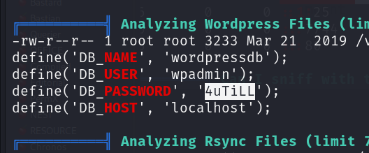

80/tcp   open  http    Apache httpd 2.4.10 ((Debian))
|_http-title: Did not follow redirect to <http://dc-2/>
|_http-server-header: Apache/2.4.10 (Debian)

a wordpress site is running:

so i found out what the users are via wpscan 

i use cewl to generate a custom wordlist

cewl <http://dc-2>  -w password.out  

and i started bruteforcing :

and get two combinations

flag 1:

flag 2:

we dont have admin creeds thats why we cant exploit wordpress to get RCE 
but i tried these cresd on ssh 
and login as tom

and then i see that this is a restricted shell :
we have some commands to execute 

flag3.txt

flag4.txt

db creds have been found:

after a lot of harword and triel and error we escape from restricted shell:

my sql db 

we try jerry's password and login in and then sudo -l 

/us/bin/git    tried to go to gtfobins and got root

THE END

