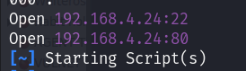

IP : 192.168.4.24
DOMAIN:  webdeveloper
OS:  ubuntu 18.04.1

OPEN_PORTS 
PORT   STATE SERVICE VERSION
22/tcp open  ssh     OpenSSH 7.6p1 Ubuntu 4 (Ubuntu Linux; protocol 2.0)

80/tcp open  http    Apache httpd 2.4.29 ((Ubuntu))
|_http-generator: WordPress 4.9.8
|_http-title: Example site &#8211; Just another WordPress site
|_http-server-header: Apache/2.4.29 (Ubuntu)

POC ->

PERFORMING A NESSUS SCAN +>

